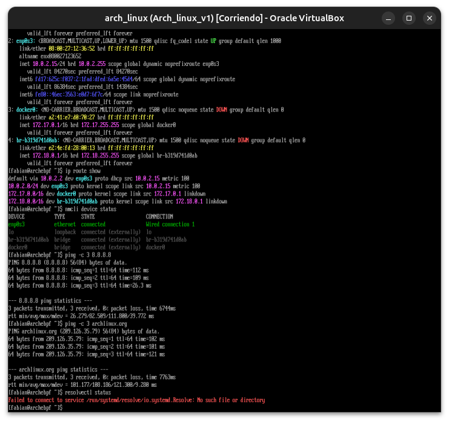
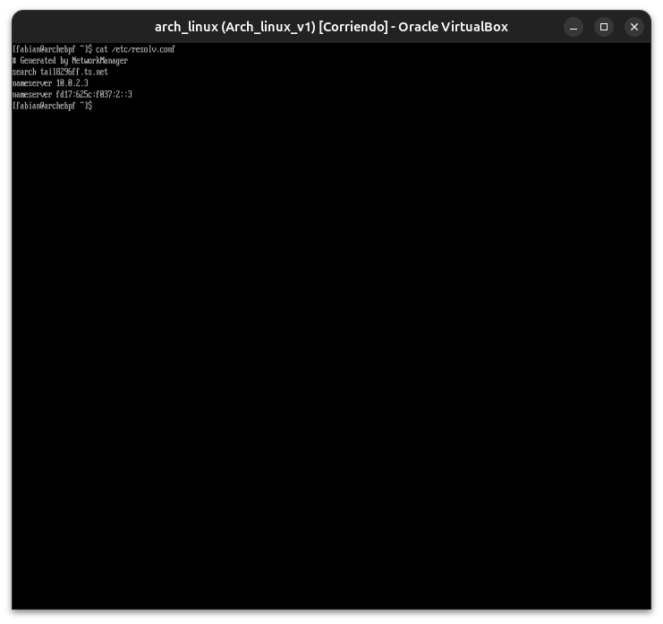
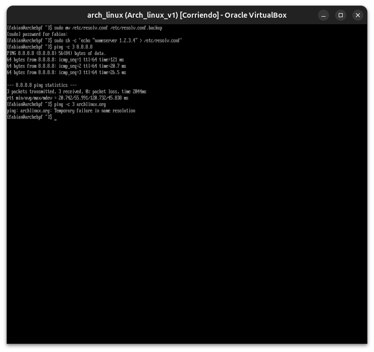
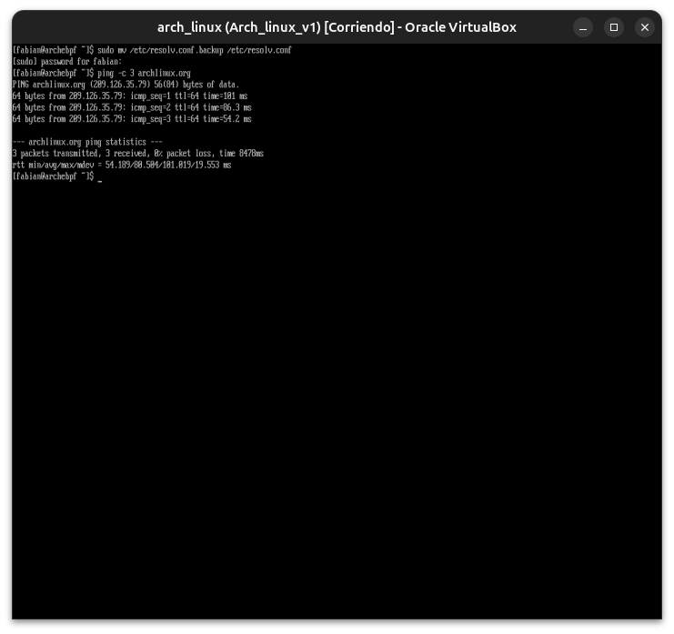

# Módulo 12 — Networking

**Fase III — Networking & Security**

---

## Objetivos del módulo

- Entender el modelo de capas de red (simplificado) y dónde encaja cada herramienta.
- Entender direcciones IP, máscaras de subred, gateway y DNS.
- Gestionar red con `NetworkManager` (`nmcli`) y con `ip` (la herramienta moderna, reemplazo de `ifconfig`).
- Diagnosticar problemas de conectividad en capas (exactamente como veníamos haciendo desde el Módulo 00).
- Resolver el incidente simulado #1 de la guía: "Resolución DNS rota".

---

## 1. CONCEPTO: el modelo de capas, simplificado para sysadmin

No vamos a estudiar las 7 capas OSI completas en detalle académico — para administración de sistemas, alcanza con este modelo práctico de 4 capas:

```
[4] Aplicación     → HTTP, SSH, DNS (el programa que usás)
[3] Transporte      → TCP/UDP (puertos, conexiones)
[2] Red              → IP (direcciones, rutas entre redes)
[1] Enlace/Física     → Ethernet, WiFi (la tarjeta de red y el cable/señal)
```

**Por qué importa pensarlo en capas:** cuando algo de red falla, la pregunta correcta no es "¿por qué no funciona internet?" sino "¿en qué capa exactamente se rompe?". ¿Tenés una interfaz de red activa (capa 1)? ¿Tenés IP asignada y podés llegar a tu gateway (capa 2)? ¿Podés conectar a un puerto remoto (capa 3)? ¿Resuelve DNS y responde la aplicación (capa 4)? Vas a aplicar exactamente esta secuencia en el diagnóstico del final del módulo.

---

## 2. POR QUÉ EXISTE: direcciones IP, subredes, gateway

### Dirección IP

Un identificador numérico único (en tu red) para cada dispositivo, ej: `192.168.1.50`. Sin ella, los paquetes de datos no sabrían a quién entregarse.

### Máscara de subred

Define qué parte de la IP identifica "la red" y qué parte identifica "el dispositivo dentro de esa red". Por ejemplo, `255.255.255.0` (o `/24` en notación CIDR) significa que los primeros 3 números (`192.168.1.`) son la red, y el último es el host específico. Esto le permite a tu sistema saber: "¿este destino está en mi misma red local, o tengo que mandarlo hacia afuera?"

### Gateway (puerta de enlace)

Es el dispositivo (normalmente tu router) al que tu sistema le envía **todo el tráfico que no es para tu propia red local** — es el "portal de salida" hacia el resto de internet.

### DNS

Traduce nombres legibles (`archlinux.org`) a direcciones IP (`146.75.28.5` o similar), porque los humanos recordamos nombres, pero las redes enrutan por números.

---

## 3. CÓMO FUNCIONA: `ip` — la herramienta moderna

`ifconfig` y `route` son comandos **obsoletos** (deprecados hace años) que quizás veas en tutoriales viejos — el estándar actual en Linux es el comando `ip`, parte del paquete `iproute2`.

```bash
ip addr show           # (o "ip a") — ver todas las interfaces de red y sus IPs asignadas
ip route show           # (o "ip r") — ver la tabla de rutas, incluyendo tu gateway por defecto
ip link show             # ver interfaces de red a nivel de enlace (arriba/abajo, MAC address)
ip neigh show             # (equivalente moderno de "arp -a") — dispositivos vistos en tu red local
```

### Interpretando `ip addr show`

```
2: enp0s3: <BROADCAST,MULTICAST,UP,LOWER_UP> mtu 1500 ...
    inet 10.0.2.15/24 brd 10.0.2.255 scope global enp0s3
```

- `enp0s3` → nombre de tu interfaz de red (el esquema de nombres moderno de Linux, basado en la ubicación física/virtual del dispositivo, no el viejo `eth0`).
- `UP` → la interfaz está activa.
- `inet 10.0.2.15/24` → tu IP y máscara en notación CIDR (`/24` = `255.255.255.0`).

---

## 4. CÓMO FUNCIONA: `NetworkManager` y `nmcli`

Ya confirmaste en el Módulo 09 que `NetworkManager.service` está corriendo — es el servicio que gestiona tu conectividad de forma automática (DHCP, WiFi, VPN). Se controla con `nmcli`:

```bash
nmcli general status              # estado general de conectividad
nmcli device status                 # qué interfaces ve, y su estado
nmcli connection show                # perfiles de conexión guardados
nmcli device show enp0s3              # detalle completo de una interfaz específica
```

---

## 5. HERRAMIENTA: comandos de diagnóstico, capa por capa

```bash
# Capa 1/2 — ¿tengo interfaz activa e IP?
ip addr show

# Capa 2 — ¿puedo llegar a mi gateway (mi router)?
ip route show   # identificar el gateway (la línea "default via X.X.X.X")
ping -c 4 <gateway>

# Capa 3 — ¿puedo llegar a algo fuera de mi red, usando solo IP (sin DNS)?
ping -c 4 8.8.8.8

# Capa 4 — ¿funciona la resolución DNS?
ping -c 4 archlinux.org
resolvectl status         # (o "cat /etc/resolv.conf") — qué servidores DNS estás usando
nslookup archlinux.org      # o "dig archlinux.org" si está instalado

# Capa 4 — ¿responde la aplicación (HTTP)?
curl -I https://archlinux.org
```

**Por qué este orden importa:** si `ping 8.8.8.8` (capa 3, por IP directa) funciona pero `ping archlinux.org` (capa 4, requiere DNS) falla, ya aislaste el problema: **no es tu red, es específicamente tu resolución DNS**. Este es exactamente el incidente simulado #1 de la guía, y lo vamos a provocar ahora.

---

## 6. EJEMPLO: recorrido de diagnóstico completo

```bash
ip addr show
ip route show
ping -c 3 $(ip route show default | awk '{print $3}')   # ping automático a tu gateway
ping -c 3 8.8.8.8
ping -c 3 archlinux.org
resolvectl status
```

---

## 7. PRÁCTICA

1. `ip addr show` — ¿qué interfaz tenés activa, y qué IP te asignó (probablemente algo `10.0.2.x`, típico de NAT en VirtualBox)?
2. `ip route show` — ¿cuál es tu gateway por defecto?
3. `nmcli device status` — ¿qué dice sobre tu interfaz?
4. Corré el recorrido completo del punto 6 y confirmá que las 4 capas responden bien.
5. `resolvectl status` — ¿qué servidor(es) DNS estás usando actualmente?

---

## 8. ERROR INTENCIONAL — Break & Fix: Resolución DNS rota (incidente #1 de la guía)

```bash
sudo mv /etc/resolv.conf /etc/resolv.conf.backup
sudo sh -c 'echo "nameserver 1.2.3.4" > /etc/resolv.conf'

ping -c 3 8.8.8.8          # esto debería seguir funcionando
ping -c 3 archlinux.org      # esto debería fallar
```

---

## 9. DIAGNÓSTICO

Metodología: SÍNTOMA → OBSERVACIÓN → LOG → CAUSA RAÍZ → SOLUCIÓN → VALIDACIÓN

1. **Síntoma:** `ping archlinux.org` falla con algo como `Temporary failure in name resolution` o se queda colgado sin resolver.
2. **Observación clave:** `ping 8.8.8.8` (por IP directa) **sí funciona** — esto aísla el problema a la capa de DNS, no a la conectividad general.
3. **Comando de diagnóstico específico:**
   ```bash
   cat /etc/resolv.conf
   ```
   Vas a ver que apunta a `1.2.3.4`, un servidor DNS inválido/inexistente que pusimos a propósito.
4. **Causa raíz:** el sistema está intentando consultar un servidor DNS que no responde.

---

## 10. SOLUCIÓN

```bash
sudo mv /etc/resolv.conf.backup /etc/resolv.conf
ping -c 3 archlinux.org      # ahora debería funcionar de nuevo
```

**Nota importante para tu sistema real:** como usás `NetworkManager` (que gestiona `/etc/resolv.conf` automáticamente, a veces a través de `systemd-resolved`), en un caso real bastaría con reiniciar el servicio para que se regenere solo:
```bash
sudo systemctl restart NetworkManager
```

**Validación:** `ping archlinux.org` responde, `resolvectl status` vuelve a mostrar servidores DNS válidos.

---

## Checklist de cierre del módulo

- [ ] Entiendo el modelo de 4 capas (aplicación/transporte/red/enlace) para diagnóstico práctico.
- [ ] Sé usar `ip addr`, `ip route`, `nmcli` para inspeccionar mi red.
- [ ] Sé diagnosticar "en capas": interfaz → gateway → IP externa → DNS → aplicación.
- [ ] Completé el laboratorio Break & Fix de DNS roto (incidente #1 de la guía) y lo reparé.

---

## Evidencias

**01 — Diagnóstico de red en capas**
Se ejecutó `ip addr show`, `ip route show` y `nmcli device status`, confirmando la interfaz `enp0s3` (IP `10.0.2.15/24`, gateway `10.0.2.2`) y las interfaces virtuales de Docker. Los `ping` a `8.8.8.8` y `archlinux.org` respondieron con 0% de pérdida, validando las 4 capas de conectividad.



**02 — `/etc/resolv.conf` original**
Contenido real del sistema, gestionado por NetworkManager: dos servidores DNS (`10.0.2.3` y su equivalente IPv6) y un dominio de búsqueda de Tailscale.



**03 — Break & Fix: DNS roto**
Tras reemplazar `/etc/resolv.conf` por un servidor DNS inválido (`1.2.3.4`), `ping 8.8.8.8` sigue funcionando (capa de red intacta) pero `ping archlinux.org` falla con `Temporary failure in name resolution` — aislando el problema exactamente en la resolución DNS.



**04 — Break & Fix: DNS restaurado y validado**
Al restaurar el `resolv.conf` original desde el backup, `archlinux.org` vuelve a resolver correctamente (`209.126.35.79`), confirmando la solución.



---

**Próximo módulo:** 13 — SSH.
