# Módulo 13 — SSH

**Fase III — Networking & Security**

---

## Objetivos del módulo

- Entender qué es SSH y por qué reemplazó a protocolos antiguos inseguros (telnet, rsh).
- Entender criptografía asimétrica a nivel conceptual (clave pública/privada).
- Configurar autenticación por clave (más segura que contraseña).
- Usar `scp`/`sftp` para transferir archivos de forma segura.
- Endurecer una configuración básica de `sshd` (base para el Módulo 14).
- Resolver el incidente simulado #2 de la guía: "Acceso SSH bloqueado".

---

## 1. CONCEPTO: ¿qué es SSH y por qué existe?

**SSH** (Secure Shell) es un protocolo que te permite abrir una terminal remota en otra máquina, de forma **cifrada y autenticada**, a través de la red.

### El problema que resolvió

Antes de SSH, protocolos como **telnet** y **rsh** hacían lo mismo pero **sin cifrado**: usuario, contraseña y todo el tráfico viajaban en texto plano por la red. Cualquiera que pudiera "escuchar" el tráfico de red (con una herramienta como `tcpdump` o `wireshark`, que vas a conocer en el Módulo 29) podía capturar tu contraseña directamente. SSH resuelve esto cifrando **todo** el canal de comunicación de punta a punta.

Esto conecta directo con lo que descubriste sin buscarlo en el Módulo 08: el certificado de Fortinet que interceptaba tu tráfico HTTPS. SSH usa un modelo de cifrado distinto (sin autoridades certificadoras centrales) que vas a entender ahora, y que es mucho más difícil de interceptar de esa forma.

---

## 2. POR QUÉ EXISTE: criptografía asimétrica (clave pública/privada)

### El concepto central

En vez de usar una única contraseña compartida, SSH puede usar un **par de claves matemáticamente relacionadas**:

- **Clave privada** — se queda siempre en tu máquina, nunca se comparte. Es tu secreto.
- **Clave pública** — se puede compartir libremente, incluso publicarla. Se coloca en cada servidor al que querés conectarte.

**La propiedad matemática que lo hace funcionar:** cualquier cosa cifrada con la clave pública **solo** puede descifrarse con la clave privada correspondiente (y viceversa, para firmas). Esto permite que un servidor "desafíe" a quien se conecta con un mensaje cifrado con tu clave pública — solo quien tenga la clave privada real puede responder correctamente, sin que la clave privada **nunca** viaje por la red.

**Por qué es más seguro que contraseñas:**
1. Una contraseña se puede adivinar por fuerza bruta o filtrarse en una brecha de datos de otro sitio (si la reutilizás).
2. Una clave privada de 256+ bits es matemáticamente inviable de adivinar.
3. La clave privada nunca se transmite — ni siquiera cifrada — por la red, a diferencia de una contraseña que sí viaja (aunque sea cifrada por el canal SSH).

---

## 3. CÓMO FUNCIONA: generar y usar un par de claves

```bash
# Generar un par de claves (ed25519 es el algoritmo moderno recomendado, más rápido y seguro que RSA)
ssh-keygen -t ed25519 -C "fabian@archebpf"
```

Te va a preguntar dónde guardar el archivo (default: `~/.ssh/id_ed25519`) y una **passphrase** opcional (una contraseña adicional que protege tu clave privada aunque alguien la robe del disco — muy recomendable, no la salteés en un uso real).

Esto genera dos archivos:
- `~/.ssh/id_ed25519` → tu clave **privada**. Permisos deben ser `600` (solo vos, lectura/escritura) — SSH se niega a funcionar si los permisos son más abiertos, por seguridad.
- `~/.ssh/id_ed25519.pub` → tu clave **pública**, la que compartís.

### Copiar tu clave pública a un servidor

```bash
ssh-copy-id usuario@servidor      # copia automáticamente tu clave pública al servidor
# o manualmente:
cat ~/.ssh/id_ed25519.pub | ssh usuario@servidor "cat >> ~/.ssh/authorized_keys"
```

El archivo `~/.ssh/authorized_keys` **en el servidor** contiene las claves públicas de todos los que tienen permiso de entrar sin contraseña.

---

## 4. HERRAMIENTA: usar el servidor SSH en tu propia VM

Vamos a instalar y probar SSH conectándote a **vos mismo** (localhost) — así no necesitás una segunda máquina para practicar.

```bash
sudo pacman -S openssh
sudo systemctl enable --now sshd

# Probar conexión a vos mismo
ssh fabian@localhost
```

La primera vez, SSH te va a mostrar el **fingerprint** (huella digital) de la clave del servidor y preguntarte si confiás en ella — esto es una protección contra ataques "man-in-the-middle" (como el que descubriste con Fortinet, pero en el contexto SSH). Al aceptar (`yes`), esa huella se guarda en `~/.ssh/known_hosts`; si alguna vez cambia sin que vos hayas reinstalado el servidor, SSH te va a **alertar fuertemente**, porque podría significar que alguien está interceptando la conexión.

### Configurar autenticación por clave hacia localhost

```bash
ssh-copy-id fabian@localhost
ssh fabian@localhost     # ahora no debería pedir contraseña
```

---

## 5. CÓMO FUNCIONA: transferencia segura de archivos

```bash
scp archivo.txt fabian@localhost:/home/fabian/copia.txt    # copiar un archivo por SSH
scp -r carpeta/ fabian@localhost:/home/fabian/destino/       # copiar una carpeta completa

sftp fabian@localhost         # sesión interactiva tipo FTP, pero cifrada (get, put, ls, cd)
```

---

## 6. CÓMO FUNCIONA: endurecer `sshd` (preview del Módulo 14)

El archivo de configuración del servidor SSH es `/etc/ssh/sshd_config`. Algunas líneas clave que vas a revisar (sin aplicarlas de forma destructiva todavía, eso lo profundizamos en el Módulo 14):

```
PermitRootLogin no          # nunca permitir login SSH directo como root
PasswordAuthentication no    # solo permitir autenticación por clave, deshabilitar contraseñas
Port 22                       # el puerto por defecto (a veces se cambia como medida menor de "seguridad por oscuridad")
```

**Advertencia importante:** nunca deshabilites `PasswordAuthentication` en un servidor real **antes** de confirmar que tu autenticación por clave ya funciona — si lo hacés al revés, podés quedar bloqueado fuera de tu propio servidor. Esto es, de hecho, exactamente el incidente que vamos a simular ahora.

---

## 7. PRÁCTICA

1. Instalá y habilitá `sshd`, conectate a `localhost` con contraseña la primera vez.
2. Generá tu par de claves con `ssh-keygen -t ed25519`.
3. Copiá tu clave pública con `ssh-copy-id fabian@localhost`.
4. Conectate de nuevo (`ssh fabian@localhost`) y confirmá que ya no pide contraseña.
5. Probá `scp` copiando un archivo de prueba hacia vos mismo.
6. `cat ~/.ssh/known_hosts` — ¿qué ves ahí?
7. `ls -l ~/.ssh/id_ed25519` — confirmá que los permisos son `600` (o similar restrictivo).

---

## 8. ERROR INTENCIONAL — Break & Fix: Acceso SSH bloqueado (incidente #2 de la guía)

> Como es tu propia VM (no un servidor remoto real), este incidente es completamente seguro de simular: siempre tenés la consola de VirtualBox como acceso de emergencia, algo que **no** tendrías en un servidor real sin acceso físico/consola remota — anotá esa diferencia, es importante para el mundo real.

```bash
sudo cp /etc/ssh/sshd_config /etc/ssh/sshd_config.backup
sudo sed -i 's/^#\?PasswordAuthentication.*/PasswordAuthentication no/' /etc/ssh/sshd_config
sudo sed -i 's/^#\?PubkeyAuthentication.*/PubkeyAuthentication no/' /etc/ssh/sshd_config
sudo systemctl restart sshd
```

(Esto deshabilita **tanto** contraseña como clave pública — un error de configuración exagerado, a propósito, para que el bloqueo sea evidente.)

```bash
ssh fabian@localhost
```

---

## 9. DIAGNÓSTICO

1. **Síntoma:** la conexión SSH es rechazada con algo como `Permission denied (publickey)` — sin siquiera ofrecerte poner una contraseña.
2. **Log del lado del servidor:**
   ```bash
   sudo journalctl -u sshd -n 20
   ```
   Deberías ver referencias a que no hay métodos de autenticación disponibles para tu conexión.
3. **Causa raíz:** revisando `/etc/ssh/sshd_config`, ambos métodos de autenticación (`PasswordAuthentication` y `PubkeyAuthentication`) quedaron en `no` — no queda ninguna forma válida de entrar.

**Lección clave para el mundo real:** este es exactamente el motivo por el que en servidores de producción reales se recomienda **siempre mantener una sesión SSH activa abierta** mientras modificás `sshd_config` — si algo sale mal, esa sesión ya autenticada sigue viva y podés revertir el cambio sin quedar bloqueado. Nunca cierres tu única sesión antes de confirmar que el cambio nuevo funciona.

---

## 10. SOLUCIÓN

Como tenés acceso directo a la consola de VirtualBox (tu "consola física" en este caso):

```bash
sudo cp /etc/ssh/sshd_config.backup /etc/ssh/sshd_config
sudo systemctl restart sshd
ssh fabian@localhost      # ahora debería volver a funcionar (por clave, ya configurada antes)
```

**Validación:** conexión exitosa sin errores, `journalctl -u sshd -n 5` sin mensajes de rechazo recientes.

---

## Checklist de cierre del módulo

- [ ] Entiendo por qué SSH reemplazó a telnet/rsh (cifrado de punta a punta).
- [ ] Entiendo el concepto de clave pública/privada y por qué es más seguro que solo contraseña.
- [ ] Configuré autenticación por clave hacia mi propia VM (localhost).
- [ ] Sé usar `scp` y `sftp`.
- [ ] Completé el laboratorio Break & Fix de SSH bloqueado (incidente #2 de la guía) y lo reparé.
- [ ] Entiendo por qué mantener una sesión activa es crítico antes de modificar `sshd_config` en un servidor real.

---

## Evidencias

**01 — openssh instalado y primera conexión**
Se instaló `openssh`, se habilitó `sshd` con `systemctl enable --now`, y se realizó la primera conexión a `localhost`: se aceptó el fingerprint del servidor (quedó guardado en `known_hosts`) y se autenticó con contraseña.

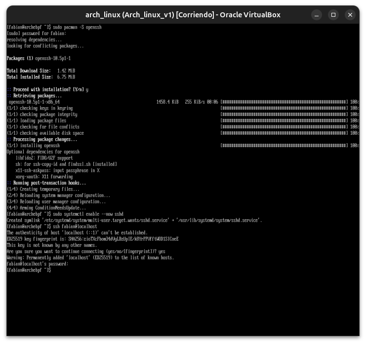

**02 — `ssh-keygen`: inicio**
Comienzo de la generación del par de claves `ed25519`, eligiendo la ubicación por defecto (`~/.ssh/id_ed25519`).

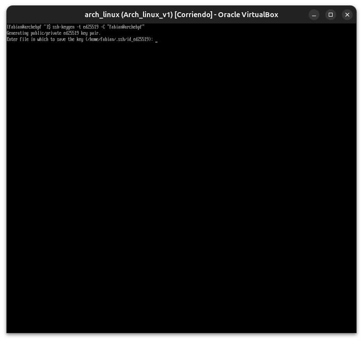

**03 — `ssh-keygen` completo**
Par de claves generado (con passphrase vacía para la práctica), mostrando el fingerprint y el "randomart" de la clave.

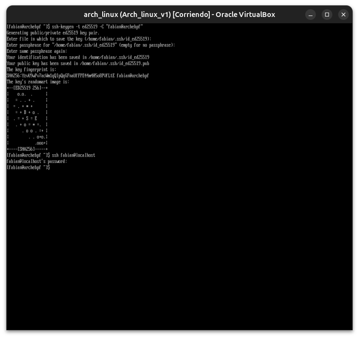

**04 — `ssh-copy-id` exitoso**
La clave pública se copió al servidor (`1 key(s) added`); la conexión siguiente ya no pidió contraseña, confirmando autenticación por clave funcionando.

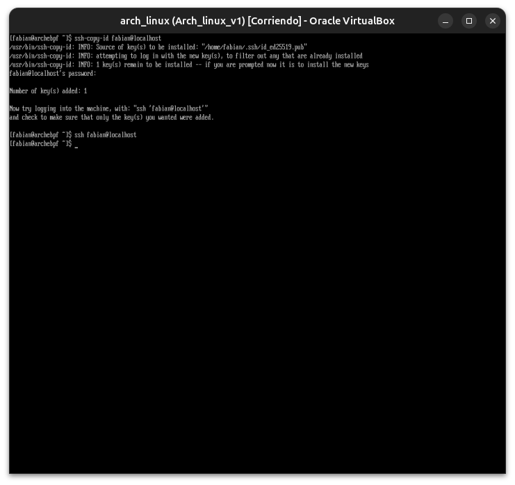

**05 — `known_hosts` y permisos de la clave privada**
`known_hosts` lista las tres huellas (ed25519, rsa, ecdsa) de `localhost`; `ls -l` confirma que `id_ed25519` tiene permisos `600` (solo el dueño puede leerla/escribirla), como exige SSH.

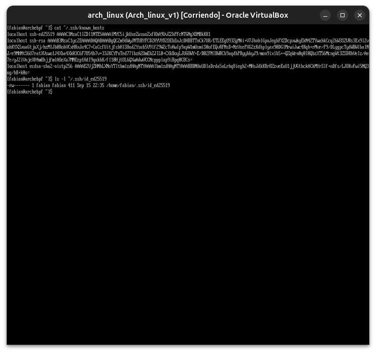

**06 — Break & Fix: `sshd_config` modificado**
Se deshabilitaron `PasswordAuthentication` y `PubkeyAuthentication` a propósito (incidente #2 de la guía) y se reinició `sshd`; la conexión sigue pidiendo contraseña, primer indicio de que hay más de una directiva involucrada.

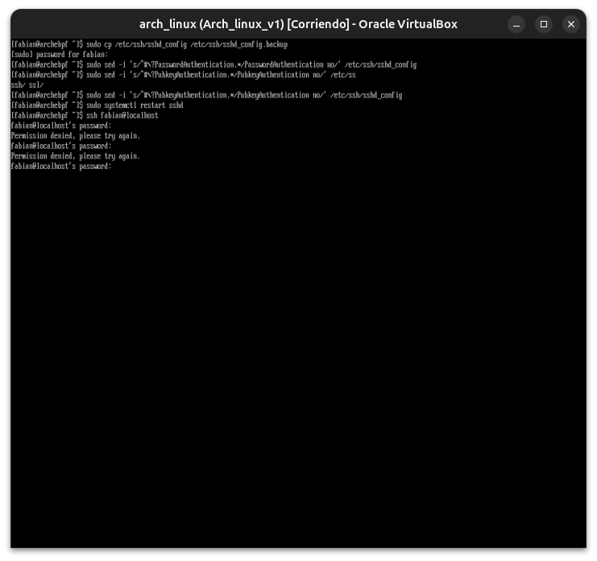

**07 — Verificación: `PasswordAuthentication` y `PubkeyAuthentication` en `no`**
`grep` confirma que ambas directivas quedaron correctamente en `no` en el archivo principal, descartando un error de edición simple.

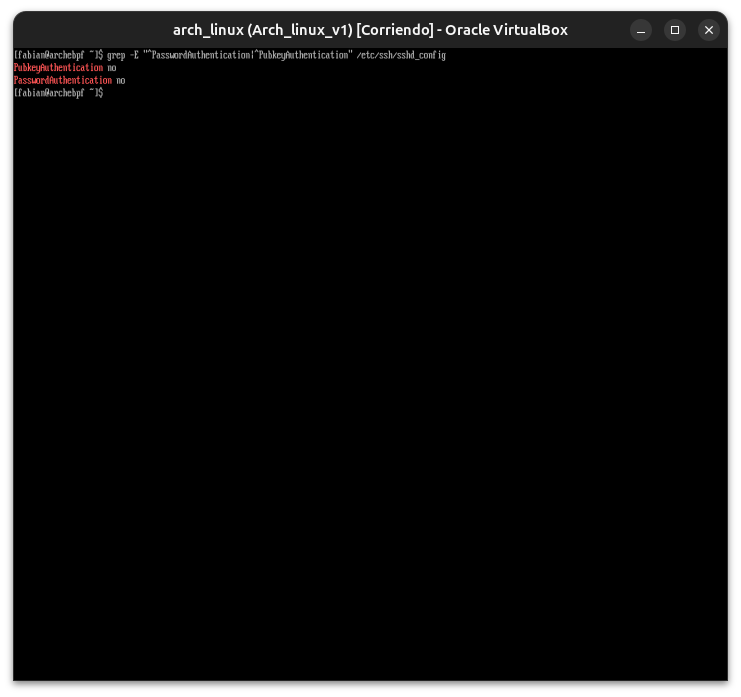

**08 — `KbdInteractiveAuthentication` y drop-ins de configuración**
Se descubre que `KbdInteractiveAuthentication` (autenticación interactiva vía PAM) puede seguir habilitada independientemente de `PasswordAuthentication`, y que existen archivos de configuración adicionales en `/etc/ssh/sshd_config.d/`.

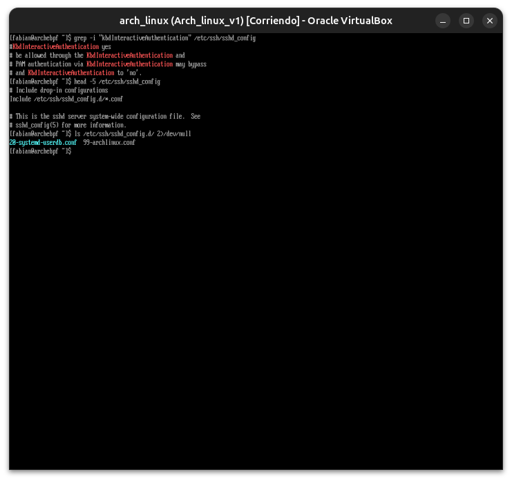

**09 — `99-archlinux.conf` y reintento de conexión**
El drop-in de Arch ya traía `KbdInteractiveAuthentication no` por defecto; tras agregarlo también en el archivo principal y reiniciar `sshd`, la conexión sigue pidiendo contraseña — el misterio persiste.

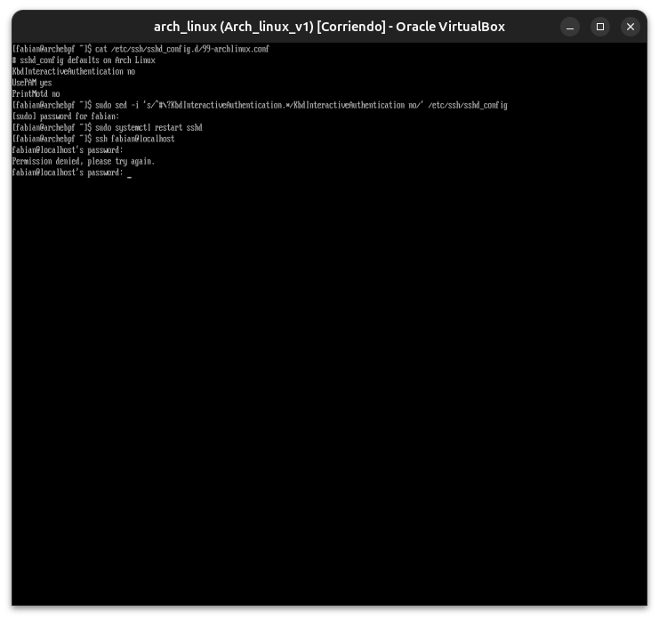

**10 — `sshd -T` confirma los tres métodos en `no`**
El volcado de configuración efectiva de `sshd` (`sshd -T`) confirma que `PasswordAuthentication`, `PubkeyAuthentication` y `KbdInteractiveAuthentication` están los tres en `no` — en teoría, ninguna autenticación debería ser posible.

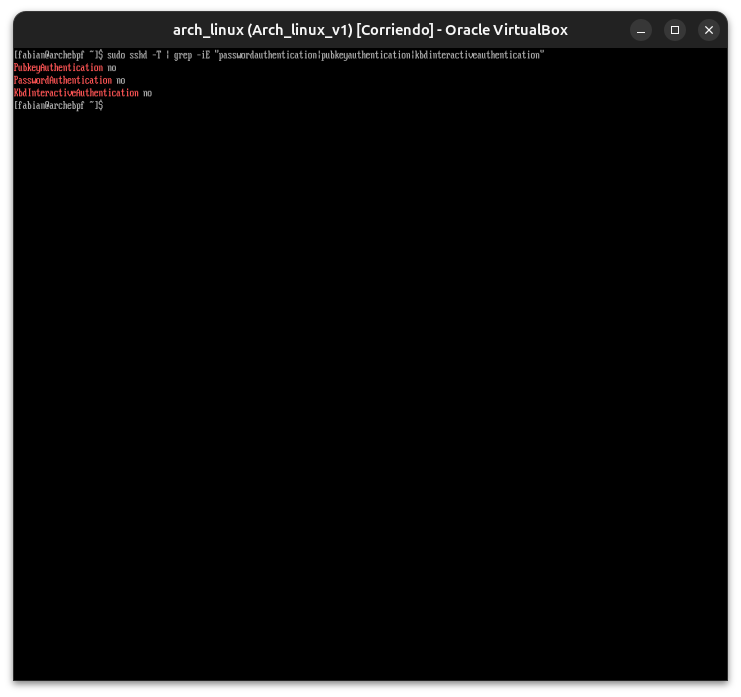

**11 — SSH sigue pidiendo contraseña (misterio en investigación)**
A pesar de la configuración efectiva confirmada, la conexión real sigue ofreciendo autenticación por contraseña — se descarta un problema de sintaxis y se profundiza el diagnóstico.

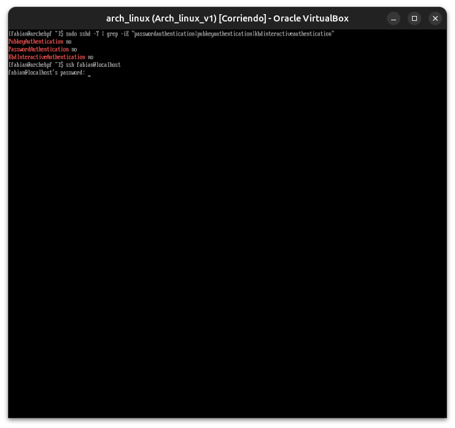

**12 — Después de reiniciar el sistema, sigue fallando igual**
Se descarta que sea un proceso `sshd` "viejo" no recargado: tras un reinicio completo de la VM, el comportamiento persiste idéntico.

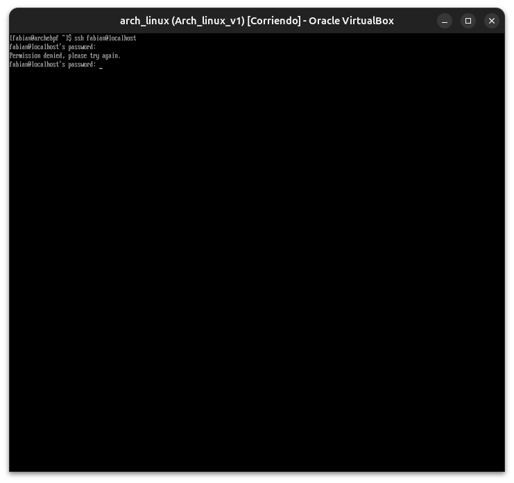

**13 — `sshd -T -C` simulando la conexión exacta**
Se usa `sshd -T -C addr=127.0.0.1,user=fabian,host=localhost` para ver la configuración tal como la evaluaría el servidor para esa conexión específica, y se descarta la existencia de bloques `Match` que pudieran estar reactivando algún método.

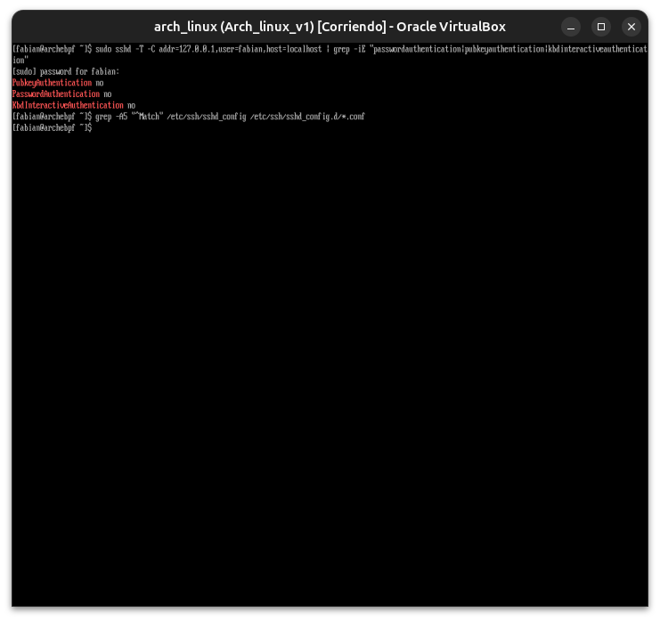

**14 — `systemctl cat sshd.service`**
Se inspecciona la unidad real de systemd para confirmar que `sshd` corre en modo tradicional (no socket-activated) y usa la ruta de configuración esperada — sin encontrar la causa raíz definitiva.

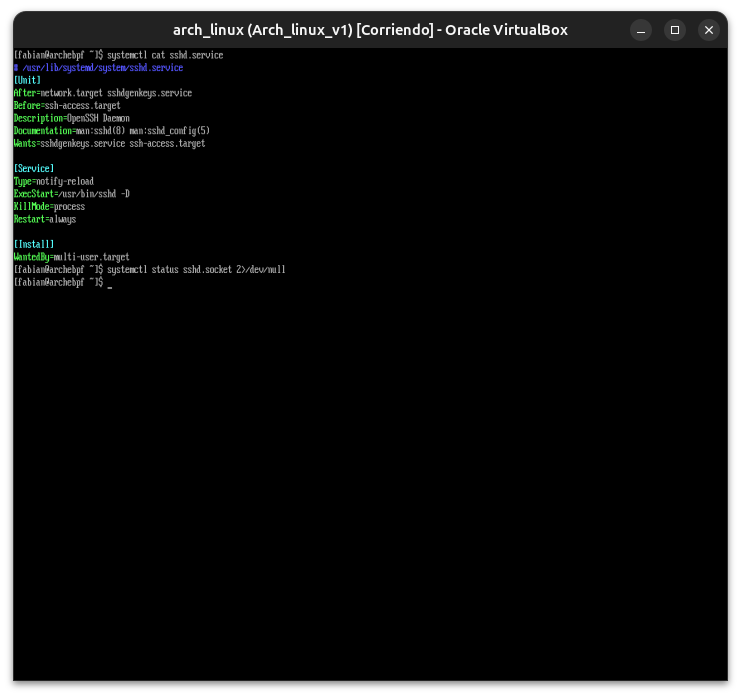

**15 — Configuración restaurada y acceso validado**
Se restauró `sshd_config` desde el backup tomado antes del experimento; la conexión por clave volvió a funcionar sin pedir contraseña, cerrando el incidente con el sistema en un estado funcional (aunque la causa exacta del comportamiento anómalo quedó documentada como misterio no resuelto).

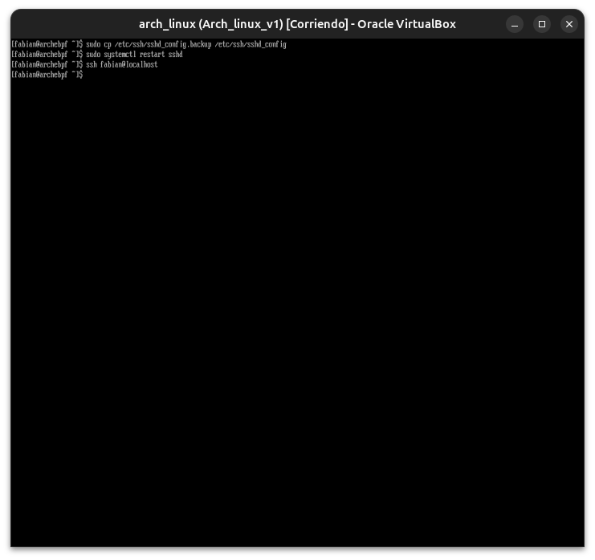

---

**Próximo módulo:** 14 — Firewall y hardening.
