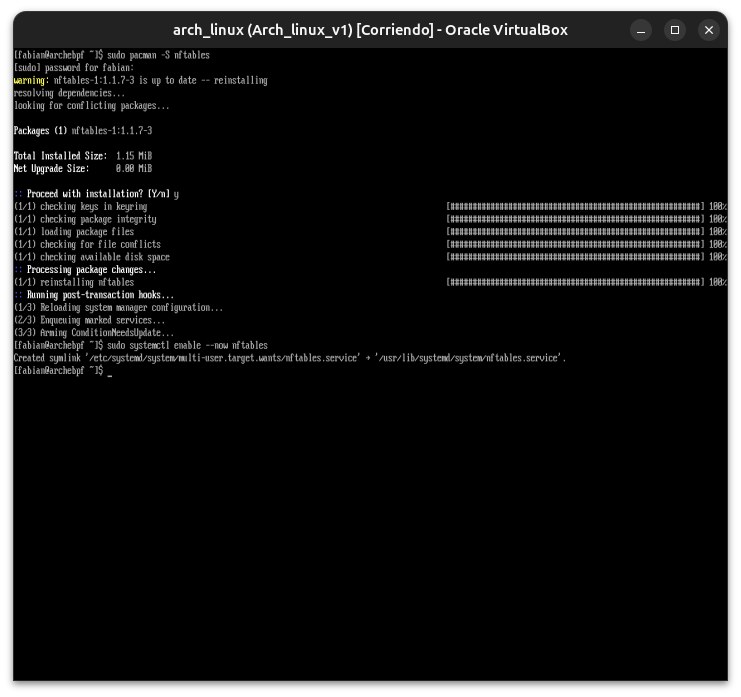

# Módulo 14 — Firewall y hardening

**Fase III — Networking & Security**

---

## Objetivos del módulo

- Entender qué es un firewall y qué problema resuelve a nivel de red.
- Entender `nftables` (el firewall moderno de Linux, sucesor de `iptables`).
- Configurar reglas básicas: política por defecto, permitir SSH, permitir servicios específicos.
- Endurecer SSH con lo aprendido en el Módulo 13 + fail2ban (protección contra fuerza bruta).
- Resolver el incidente simulado #8 de la guía: "Firewall mal configurado (bloqueo total)".

---

## 1. CONCEPTO: ¿qué es un firewall?

Un **firewall** es una capa de filtrado que decide, paquete por paquete, **qué tráfico de red se permite entrar o salir** de tu sistema, basándose en reglas (puerto, protocolo, origen, destino, estado de la conexión).

**Por qué existe:** por defecto, un sistema Linux acepta conexiones a cualquier puerto donde haya un servicio escuchando. Si instalás un servicio (por ejemplo, una base de datos) que solo debería ser accesible desde tu propia red local, sin firewall **cualquiera en internet podría intentar conectarse a él**. El firewall es la capa que decide explícitamente qué está permitido, en vez de confiar en que "nadie va a intentar conectarse a un puerto que no anuncié".

Este es el principio de **"denegar por defecto, permitir explícitamente"** — la base de toda la seguridad perimetral moderna.

---

## 2. POR QUÉ EXISTE: `nftables` reemplazando a `iptables`

### El sistema antiguo (`iptables`)

Durante años, Linux usó `iptables` para filtrado de paquetes. Funcionaba, pero tenía limitaciones: sintaxis inconsistente entre IPv4 (`iptables`) e IPv6 (`ip6tables`, un comando completamente separado), reglas que se evaluaban de forma menos eficiente a gran escala, y una sintaxis que se volvía difícil de mantener en configuraciones complejas.

### La solución: `nftables`

`nftables` es el sucesor oficial del kernel Linux, con:
- **Sintaxis unificada** para IPv4 e IPv6 en las mismas reglas.
- **Mejor rendimiento** en conjuntos de reglas grandes.
- Es el **estándar actual recomendado** en Arch Linux y la mayoría de distros modernas.

**Nota:** `iptables` sigue funcionando (por compatibilidad), pero para este curso vamos a usar `nftables` directamente, como corresponde a un sistema moderno.

---

## 3. CÓMO FUNCIONA: la estructura de `nftables`

```
Tabla (table)
   └── Cadena (chain)
         └── Regla (rule)
```

- **Tabla:** un contenedor lógico de reglas, asociado a una familia de protocolo (`ip`, `ip6`, `inet` para ambos).
- **Cadena:** un punto de "enganche" (hook) en el flujo de red — por ejemplo, `input` (tráfico entrante destinado a este sistema), `output` (tráfico saliente), `forward` (tráfico que pasa a través, si el sistema hace de router).
- **Regla:** la condición específica y la acción (`accept`, `drop`, `reject`) a tomar.

```bash
sudo pacman -S nftables
sudo systemctl enable --now nftables

nft list ruleset          # ver todas las reglas actuales
```

---

## 4. HERRAMIENTA: crear un firewall básico y seguro

Vamos a crear una configuración con la filosofía correcta: **denegar todo por defecto, permitir explícitamente lo necesario**.

```bash
sudo nano /etc/nftables.conf
```

Contenido:

```
#!/usr/sbin/nft -f

flush ruleset

table inet filter {
    chain input {
        type filter hook input priority 0; policy drop;

        # Permitir tráfico ya establecido o relacionado (respuestas a conexiones que iniciaste vos)
        ct state established,related accept

        # Permitir loopback (comunicación interna de la propia máquina, ej: localhost)
        iif lo accept

        # Permitir ICMP (ping) — útil para diagnóstico
        ip protocol icmp accept

        # Permitir SSH (puerto 22)
        tcp dport 22 accept

        # Cualquier otra cosa entrante: rechazada
    }

    chain forward {
        type filter hook forward priority 0; policy drop;
    }

    chain output {
        type filter hook output priority 0; policy accept;
    }
}
```

**Por qué cada línea importa:**
- `policy drop` en `input` → **denegar todo por defecto**, la base de la seguridad perimetral.
- `ct state established,related accept` → sin esto, ni siquiera podrías recibir las respuestas de tus propias conexiones salientes (por ejemplo, la respuesta de un sitio web que vos mismo visitaste) — el firewall necesita "recordar" que esa conexión la iniciaste vos.
- `iif lo accept` → sin esto, servicios locales que se comunican consigo mismos (como algunas herramientas de systemd) fallarían.
- `tcp dport 22 accept` → dejamos pasar SSH explícitamente, porque lo necesitamos (Módulo 13).

Aplicar y verificar:

```bash
sudo nft -c -f /etc/nftables.conf    # -c = check, valida sintaxis SIN aplicar (¡hacé esto siempre primero!)
sudo systemctl restart nftables
sudo nft list ruleset
```

**Regla de oro:** `nft -c -f` antes de aplicar cualquier cambio real — te ahorra bloquearte con un error de sintaxis.

---

## 5. CÓMO FUNCIONA: `fail2ban` — protección contra fuerza bruta

Un firewall estático no te protege de alguien que intenta miles de contraseñas contra tu SSH (si todavía tenés `PasswordAuthentication` habilitado en algún escenario). **`fail2ban`** monitorea logs (vía journal) y **bloquea dinámicamente** IPs que muestran patrones de ataque.

```bash
sudo pacman -S fail2ban

sudo tee /etc/fail2ban/jail.local << 'EOF'
[sshd]
enabled = true
port = 22
backend = systemd
maxretry = 3
bantime = 600
EOF
```

(Si preferís evitar el heredoc como en el Módulo 09, usá `nano` para crear ese archivo con ese contenido)

```bash
sudo systemctl enable --now fail2ban
sudo fail2ban-client status sshd
```

`maxretry = 3` + `bantime = 600` significa: después de 3 intentos fallidos de SSH desde una misma IP, esa IP queda bloqueada por 600 segundos (10 minutos).

---

## 6. EJEMPLO

```bash
# Ver el estado del firewall
sudo nft list ruleset

# Ver los "bans" activos de fail2ban
sudo fail2ban-client status sshd

# Probar que tu SSH sigue funcionando con el firewall activo
ssh fabian@localhost
```

---

## 7. PRÁCTICA

1. Instalá `nftables`, creá la configuración base de la sección 4, validala con `nft -c -f`, aplicala.
2. `sudo nft list ruleset` — confirmá que tu política de `input` es `drop` y que la regla de SSH está presente.
3. `ssh fabian@localhost` — confirmá que sigue funcionando (porque dejaste el puerto 22 abierto explícitamente).
4. Instalá y configurá `fail2ban` como en la sección 5.
5. `sudo fail2ban-client status sshd` — ¿qué información te muestra?

---

## 8. ERROR INTENCIONAL — Break & Fix: Firewall mal configurado (incidente #8 de la guía)

> Como siempre que tocamos algo que puede bloquear tu acceso: tenés la consola de VirtualBox como red de seguridad. Igual, tomá un snapshot rápido antes de este laboratorio si querés máxima tranquilidad.

Vamos a simular el error clásico: **olvidar dejar SSH abierto antes de aplicar una política `drop`**.

```bash
sudo cp /etc/nftables.conf /etc/nftables.conf.backup
sudo nano /etc/nftables.conf
```

Quitá (o comentá con `#`) la línea `tcp dport 22 accept`, dejando `policy drop` sin ninguna excepción para SSH. Guardá y aplicá:

```bash
sudo nft -c -f /etc/nftables.conf   # esto SÍ va a validar bien la sintaxis (es válida, solo está mal pensada)
sudo systemctl restart nftables
```

Ahora, **desde otra terminal/sesión** (importante: no cierres la que ya tenés abierta — es la lección del Módulo 13 aplicada de nuevo), intentá:

```bash
ssh fabian@localhost
```

---

## 9. DIAGNÓSTICO

1. **Síntoma:** la nueva conexión SSH se queda "colgada" intentando conectar, sin respuesta (`drop` descarta el paquete silenciosamente, a diferencia de `reject` que respondería con un error inmediato — otra decisión de diseño para dificultarle la tarea a un atacante que escanea puertos).
2. **Observación clave:** tu sesión SSH **anterior**, ya autenticada antes del cambio, sigue funcionando (porque `ct state established,related accept` permite el tráfico de conexiones ya establecidas).
3. **Causa raíz:** `sudo nft list ruleset` en tu sesión ya abierta va a mostrar que falta la regla `tcp dport 22 accept`.

**Esta es la razón exacta de la "regla de oro" de mantener una sesión activa:** sin ella, este error te habría dejado completamente bloqueado fuera de tu propio sistema (salvo por la consola de VirtualBox).

---

## 10. SOLUCIÓN

Desde tu sesión ya activa:

```bash
sudo cp /etc/nftables.conf.backup /etc/nftables.conf
sudo nft -c -f /etc/nftables.conf
sudo systemctl restart nftables
```

**Validación:** desde una terminal nueva, `ssh fabian@localhost` debería volver a conectar sin problema.

---

## Checklist de cierre del módulo

- [ ] Entiendo el principio "denegar por defecto, permitir explícitamente".
- [ ] Sé la diferencia entre `nftables` (moderno) e `iptables` (legado).
- [ ] Puedo crear una configuración básica de tabla/cadena/regla en `nftables.conf`.
- [ ] Sé validar sintaxis con `nft -c -f` ANTES de aplicar cualquier cambio.
- [ ] Configuré `fail2ban` para proteger SSH de fuerza bruta.
- [ ] Completé el laboratorio Break & Fix de firewall mal configurado (incidente #8) manteniendo una sesión activa como red de seguridad.

---

## Evidencias



---

**Próximo módulo:** 15 — Logs y troubleshooting.
