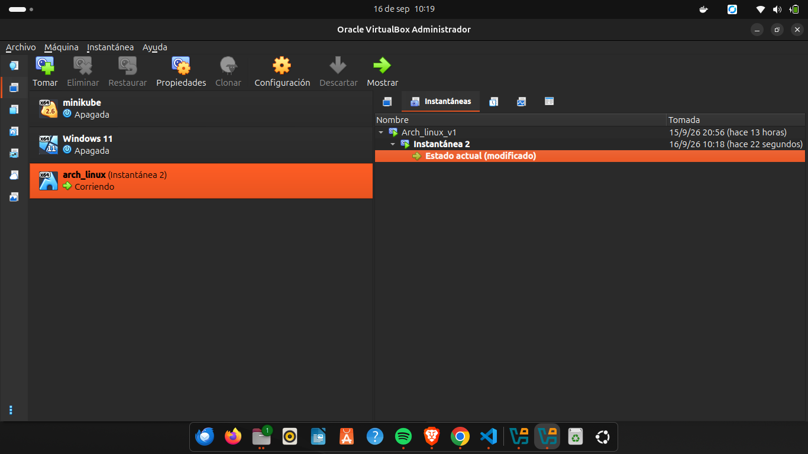
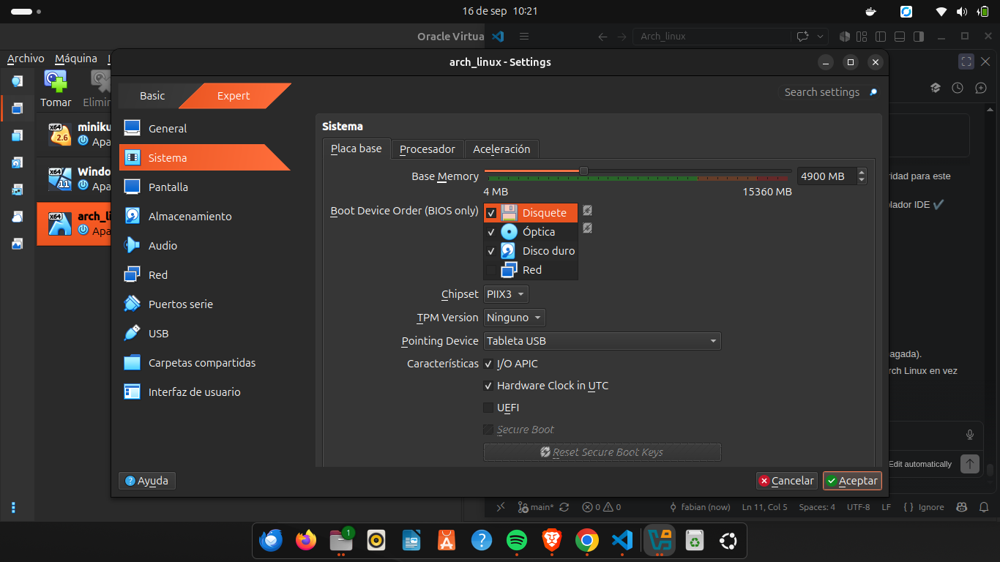
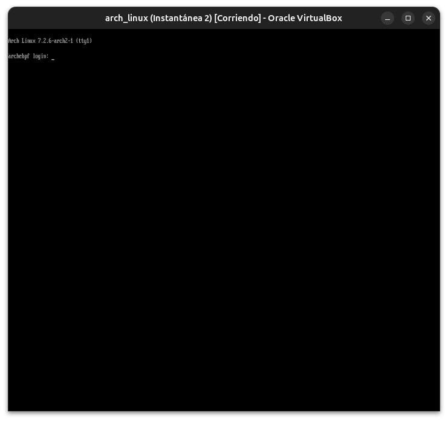
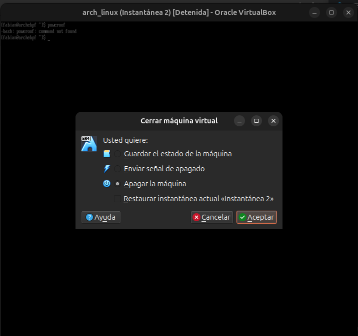
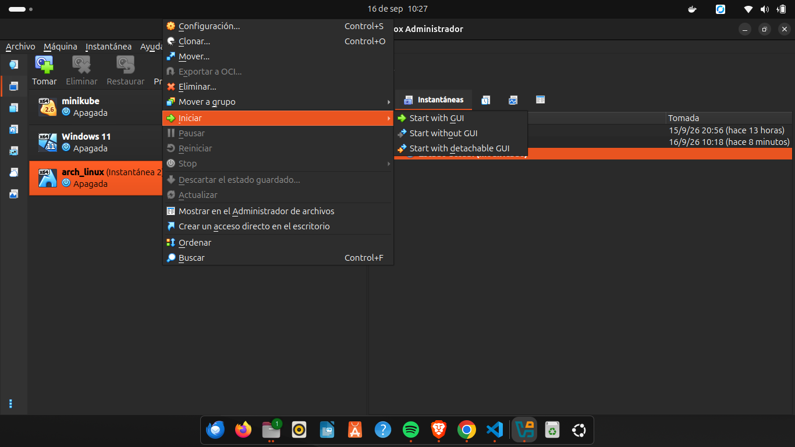
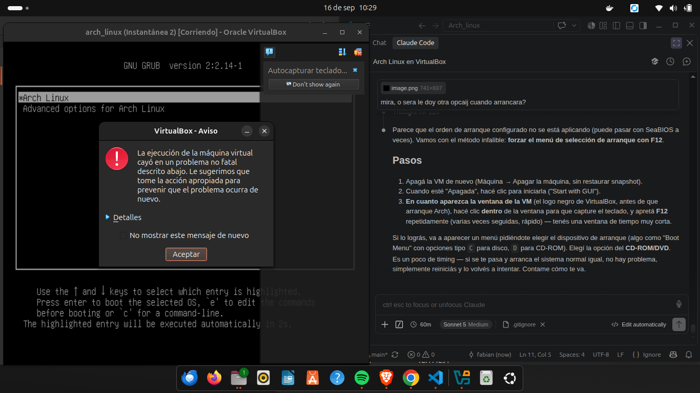
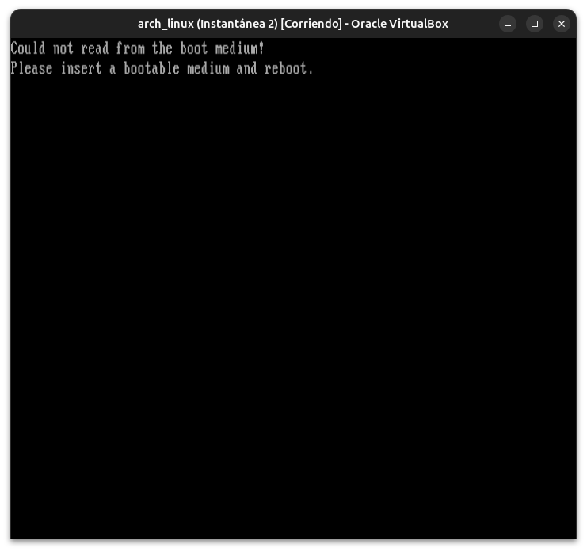
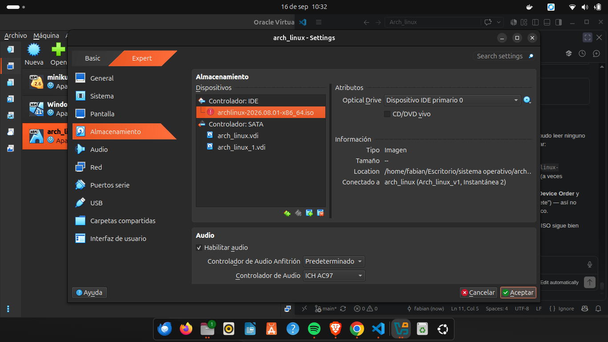

# Módulo 16 — Recuperación de sistemas rotos

**Fase III — Networking & Security**

Con este módulo cerramos la Fase III.

> ⚠️ **Tomá un snapshot de VirtualBox antes de empezar.** Este módulo rompe tu sistema de verdad (a propósito) y lo repara desde un medio de arranque externo. Es el módulo de mayor riesgo del curso hasta ahora — la red de seguridad es obligatoria, no opcional.

---

## Objetivos del módulo

- Entender el proceso general de recuperación de un sistema que no arranca.
- Arrancar desde un medio de instalación de Arch Linux (ISO live) en vez del disco.
- Montar manualmente las particiones de un sistema "roto" y entrar con `arch-chroot`.
- Resolver el incidente simulado #5 de la guía: "`/etc/fstab` corrupto".
- Resolver el incidente simulado #7 de la guía: "initramfs corrupto".
- Reparar el bootloader desde cero si hiciera falta.

---

## 1. CONCEPTO: ¿por qué existe un "modo de rescate"?

Cuando un sistema no puede completar su propio arranque (recordá la cadena del Módulo 10: firmware → bootloader → kernel → initramfs → systemd), **no podés usar herramientas del propio sistema para repararlo** — porque el sistema no está corriendo. Necesitás un entorno **completamente independiente** que arranque por su cuenta, con sus propias herramientas, y que te permita acceder al disco del sistema roto "desde afuera".

Esto es exactamente lo que hace un **medio de instalación live** (el mismo ISO que se usa para instalar Arch desde cero, Módulo 06): es un sistema Linux completo y funcional que corre desde RAM/USB/CD, sin depender en absoluto del disco que necesitás reparar.

---

## 2. POR QUÉ EXISTE: `arch-chroot`

Ya lo mencionamos conceptualmente en el Módulo 06. `arch-chroot` te permite, desde el sistema live, **"entrar"** al sistema instalado en el disco (montado en algún punto, ej. `/mnt`) como si hubieras arrancado normalmente en él — mismos comandos, mismo `pacman`, mismo `systemctl` — pero llegaste ahí "desde afuera", sin que ese sistema roto haya tenido que arrancar por sí mismo.

**Por qué es mejor que un `chroot` genérico:** `arch-chroot` (a diferencia de un `chroot` básico de Linux) también monta automáticamente `/proc`, `/sys`, `/dev` dentro del entorno — sin eso, muchos comandos (como `mkinitcpio` o `grub-mkconfig`) fallarían porque necesitan acceso a esos sistemas de archivos virtuales del kernel.

---

## 3. HERRAMIENTA: preparar el arranque desde el ISO live

### 3.1 Adjuntar el ISO (si no está ya)

Verificá en VirtualBox: **Configuración → Almacenamiento → Controlador IDE** debería tener el archivo `archlinux-*.iso` adjunto (ya lo vimos en pantalla en módulos anteriores).

### 3.2 Forzar el arranque desde el ISO una sola vez

Con la VM apagada:
1. Click derecho en la VM → **Configuración → Sistema → Orden de arranque** → asegurate que "Óptico" esté antes que "Disco duro" (o marcalo).
2. Encendé la VM — debería bootear el instalador de Arch en vez de tu sistema normal.

(Alternativa más prolija: mantené apretada la tecla que abre el menú de boot de la VM al iniciar, si tu configuración lo soporta, para elegir el ISO solo esta vez sin cambiar el orden permanente.)

### 3.3 Verificar que estás en el entorno live

```bash
# Deberías ver un prompt tipo "root@archiso ~ #"
lsblk
```

Vas a ver tu disco `sda` con sus particiones (`sda1`, `sda2`) — pero **sin montar todavía**, porque este es un sistema completamente distinto corriendo en RAM.

---

## 4. CÓMO FUNCIONA: montar el sistema roto y entrar con chroot

```bash
mount /dev/sda2 /mnt              # montar la raíz de tu sistema real
mount /dev/sda1 /mnt/boot          # montar boot dentro de la estructura montada
arch-chroot /mnt                    # "entrar" al sistema real
```

Una vez adentro del `arch-chroot`, estás operando **como si hubieras arrancado tu propio Arch normalmente** — podés usar `pacman`, editar archivos de `/etc`, regenerar el initramfs, reinstalar el bootloader, etc.

```bash
# Para salir del chroot cuando termines:
exit
umount -R /mnt
reboot
```

---

## 5. ERROR INTENCIONAL — Break & Fix: `/etc/fstab` corrupto (incidente #5 de la guía)

**Desde tu sistema normal (todavía no arrancado desde el ISO)**, provoquemos el daño:

```bash
sudo cp /etc/fstab /etc/fstab.backup-real   # respaldo de verdad, fuera del sistema que vamos a romper
sudo sh -c 'echo "esto rompe fstab completamente" > /etc/fstab'
sudo reboot
```

Al reiniciar, el sistema probablemente **no logre montar la raíz** y caiga a un shell de emergencia, o se cuelgue durante el arranque — exactamente el escenario que anticipamos en el Módulo 06.

### 5.1 Diagnóstico

Si ves algo como `Failed to mount /`, `emergency mode`, o el arranque se detiene indefinidamente: confirmado, es el incidente que provocamos. Esto ocurre en la etapa **initramfs → systemd** de la cadena de arranque (Módulo 10): el kernel e initramfs cargaron bien, pero systemd no puede continuar sin saber qué montar como raíz real.

### 5.2 Solución — arrancar desde el ISO y reparar

Seguí los pasos de la sección 3 y 4 para entrar por `arch-chroot`. Una vez adentro:

```bash
# El fstab corrupto está ahora en /etc/fstab dentro del chroot
cat /etc/fstab       # confirmar que ves la línea rota

# Restaurar desde el backup que hicimos ANTES de romperlo
cp /etc/fstab.backup-real /etc/fstab
cat /etc/fstab        # confirmar que volvió a la normalidad

exit
umount -R /mnt
reboot
```

**Validación:** el sistema debería arrancar normalmente esta vez, llegando hasta el login.

---

## 6. ERROR INTENCIONAL — Break & Fix: initramfs corrupto (incidente #7 de la guía)

> Este es más delicado — vamos a corromper el archivo real de initramfs. Confirmá que tu snapshot sigue disponible.

**Desde tu sistema normal:**

```bash
sudo cp /boot/initramfs-linux.img /boot/initramfs-linux.img.backup-real
sudo sh -c 'echo "corrupto" > /boot/initramfs-linux.img'
sudo reboot
```

Al reiniciar, el kernel probablemente no logre descomprimir/montar el initramfs correctamente. Vas a ver errores tempranos de arranque, posiblemente un kernel panic o un cuelgue antes de llegar a systemd — una falla en una etapa **más temprana** que la del `fstab` (initramfs, en vez de systemd).

### 6.1 Diagnóstico

Esta falla ocurre en la etapa **kernel → initramfs** de la cadena (Módulo 10) — antes incluso de que el sistema pueda intentar montar la raíz real. Es coherente con lo que anticipamos: un initramfs roto es más grave que un `fstab` roto, porque bloquea una etapa anterior.

### 6.2 Solución — reparar desde el ISO live

```bash
mount /dev/sda2 /mnt
mount /dev/sda1 /mnt/boot
arch-chroot /mnt

# Restaurar el respaldo bueno
cp /boot/initramfs-linux.img.backup-real /boot/initramfs-linux.img

# O, alternativa más "real" (lo que harías si no tuvieras backup):
mkinitcpio -P

exit
umount -R /mnt
reboot
```

**Nota importante:** en un caso real sin backup, `mkinitcpio -P` desde el chroot es exactamente la herramienta correcta — regenera el initramfs desde cero usando la configuración de `/etc/mkinitcpio.conf` que ya está en el sistema, sin necesitar ningún respaldo previo.

---

## 7. Reparación de bootloader desde chroot (repaso, conectando con el Módulo 10)

Si alguna vez GRUB estuviera dañado más allá de lo que reparamos en el Módulo 10, el proceso completo desde `arch-chroot` sería:

```bash
grub-install --target=i386-pc /dev/sda    # reinstala GRUB en el MBR (tu caso: BIOS legacy)
grub-mkconfig -o /boot/grub/grub.cfg        # regenera la configuración
```

---

## 8. PRÁCTICA

1. Confirmá tu snapshot de VirtualBox.
2. Ejecutá el Break & Fix de `fstab` (sección 5) completo: romper, reiniciar, diagnosticar el fallo en pantalla, arrancar desde ISO, `arch-chroot`, reparar, reiniciar, validar.
3. Ejecutá el Break & Fix de initramfs (sección 6) completo, de la misma manera.
4. Anotá (para vos, o contame) en qué etapa exacta de la cadena de arranque (Módulo 10) falló cada incidente, y por qué uno bloqueaba antes que el otro.

---

## Checklist de cierre del módulo (y de la Fase III completa)

- [ ] Entiendo por qué se necesita un medio de arranque externo para reparar un sistema que no bootea.
- [ ] Sé montar particiones manualmente y usar `arch-chroot`.
- [ ] Completé y reparé el incidente de `/etc/fstab` corrupto (incidente #5).
- [ ] Completé y reparé el incidente de initramfs corrupto (incidente #7).
- [ ] Entiendo en qué etapa de la cadena de arranque falla cada tipo de corrupción.
- [ ] Sé reinstalar GRUB desde un chroot si hiciera falta.

---

## Nota real del curso: cuando el laboratorio se topa con un imprevisto

Al intentar arrancar desde el ISO live para este módulo, descubrimos que el archivo `archlinux-*.iso` ya no existía en el disco (probablemente borrado después de la instalación original). Esto generó una sesión completa de troubleshooting real — cambiar el orden de arranque, forzar apagados limpios, intentar el menú F12, hasta encontrar la causa raíz: VirtualBox marcaba el ISO con un ícono de advertencia (medio inaccesible). Quedó documentado abajo como evidencia de diagnóstico real, y el laboratorio de `arch-chroot` (secciones 5 y 6) se retoma en cuanto se descargue un ISO nuevo.

## Evidencias










---

## Cierre de Fase III — Networking & Security

Con este módulo termina la Fase III completa: Networking, SSH, Firewall/hardening, Logs/troubleshooting, y Recuperación de sistemas rotos. A esta altura ya completaste 8 de los 10 incidentes "Break & Fix" oficiales de la guía (#1, #2, #4, #5, #6, #7, #8, #9 — quedan pendientes #3 "Permisos de archivos incorrectos" y #10 "Conflicto de gestión de paquetes", que vas a resolver naturalmente más adelante en el curso).

---

**Próximo módulo:** 17 — Bash profesional (inicio de la Fase IV — Development & Automation).
