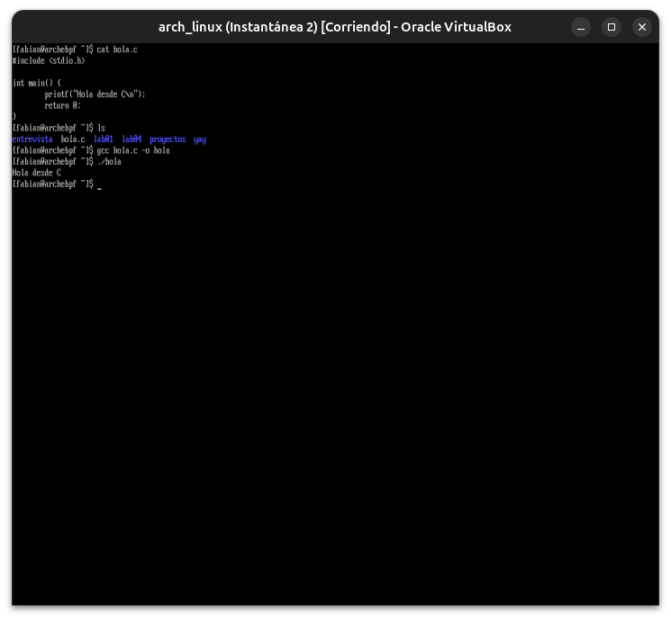
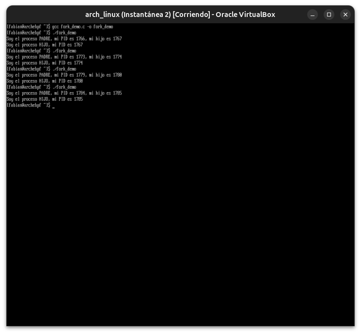
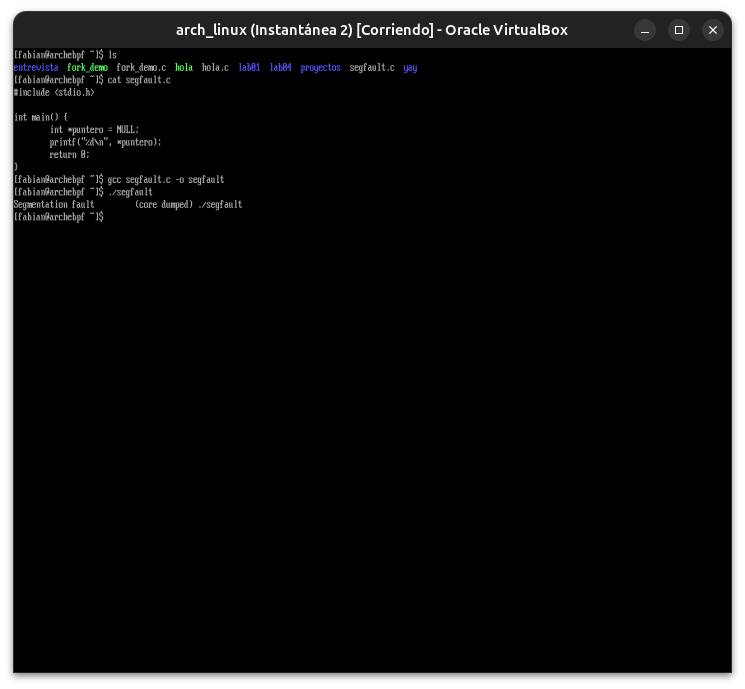
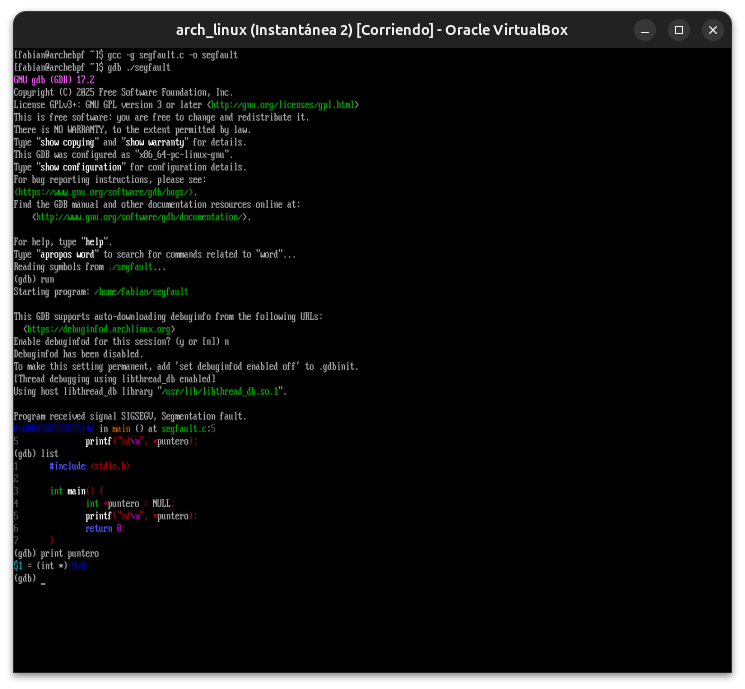

# Módulo 20 — C para entender Linux

**Fase IV — Development & Automation**

---

## Objetivos del módulo

- Entender por qué C es el lenguaje en el que está escrito el propio kernel Linux, y por qué eso importa para vos.
- Compilar programas con `gcc` y entender el proceso de compilación.
- Entender memoria: stack, heap, punteros — la base para entender cómo Linux gestiona procesos.
- Hacer llamadas al sistema (syscalls) directamente desde C.
- Diagnosticar un segfault con `gdb`.

> **Nota sobre este módulo:** a diferencia de Python, **C no es sensible a la indentación** — los bloques se delimitan con `{ }`, no con espacios. Esto elimina de raíz el tipo de errores que tuviste en el Módulo 19 (TabError, IndentationError). El riesgo en C es distinto: errores de memoria (punteros mal usados) que no siempre avisan con un mensaje claro — por eso `gdb` es tan importante acá.

---

## 1. CONCEPTO: ¿por qué C para entender Linux?

El kernel Linux está escrito casi enteramente en C. Cuando ejecutaste `strace`, revisaste `/proc`, o simplemente corriste cualquier programa en este curso, por debajo **todo pasa por llamadas al sistema (syscalls)** — el punto de contacto entre un programa en espacio de usuario y el kernel. C es el lenguaje que expone esas syscalls de la forma más directa posible, sin capas de abstracción intermedias (a diferencia de Python o Bash).

**Por qué te importa, aunque nunca vayas a programar el kernel:** entender C te da un modelo mental correcto de **qué es realmente un proceso, la memoria, un archivo abierto** — conceptos que usaste todo el curso (Módulo 05: procesos, Módulo 02: filesystem) pero ahora los vas a ver "desde adentro".

---

## 2. HERRAMIENTA: compilar con `gcc`

```bash
sudo pacman -S gcc

nano hola.c
```

```c
#include <stdio.h>

int main() {
    printf("Hola desde C\n");
    return 0;
}
```

```bash
gcc hola.c -o hola
./hola
```

**Qué pasó en el `gcc`:** el código fuente (`hola.c`) pasó por preprocesador → compilador → ensamblador → enlazador (linker), terminando en un binario ejecutable nativo (`hola`) — nada de intérprete corriendo por encima, como sí pasa con Python o Bash. Por eso los programas en C corren directamente como instrucciones de la CPU.

---

## 3. CONCEPTO: memoria — stack, heap, punteros

### Stack vs. Heap

```c
int main() {
    int numero = 5;              // vive en el STACK: se libera automáticamente al salir de la función
    int *puntero = malloc(sizeof(int));  // vive en el HEAP: vos sos responsable de liberarlo
    *puntero = 10;
    free(puntero);                 // liberación manual — si te olvidás, es un "memory leak"
    return 0;
}
```

**Por qué existe esta diferencia (conectando con el Módulo 00):** el stack es rápido pero de tamaño fijo y se gestiona automáticamente (cada función que llamás "apila" su espacio, y lo libera al terminar). El heap es más flexible (podés pedir memoria en tiempo de ejecución, del tamaño que necesites), pero **vos** sos responsable de pedirla (`malloc`) y devolverla (`free`) — si no la devolvés, es una fuga de memoria; si la usás después de liberarla, es un bug grave ("use after free").

### Punteros

Un puntero es una variable que **guarda una dirección de memoria**, no un valor directo.

```c
int x = 5;
int *p = &x;      // p guarda la DIRECCIÓN de x (& = "dirección de")
printf("%d\n", *p);  // *p = "el valor que está en esa dirección" (10... digo 5)
*p = 10;               // modifica x indirectamente, a través del puntero
printf("%d\n", x);      // ahora x vale 10
```

**Por qué importan:** son la base de cómo C pasa datos grandes entre funciones sin copiarlos, cómo se implementan arrays, y cómo el propio kernel maneja estructuras de datos de procesos, memoria de dispositivos, etc.

---

## 4. CÓMO FUNCIONA: syscalls directas desde C

```c
#include <unistd.h>
#include <sys/types.h>
#include <stdio.h>

int main() {
    pid_t pid = getpid();                    // syscall: obtener el PID del proceso actual
    printf("Mi PID es: %d\n", pid);

    write(1, "Esto se escribe con write(), no printf\n", 40);  // syscall directa a stdout (fd 1)

    return 0;
}
```

**Conexión directa con el Módulo 05:** `getpid()` es la misma información que veías en `ps aux`, pero ahora la estás pidiendo directamente al kernel, sin intermediarios.

### `fork()` — crear un proceso, en C, de verdad

```c
#include <unistd.h>
#include <stdio.h>

int main() {
    pid_t pid = fork();

    if (pid == 0) {
        printf("Soy el proceso HIJO, mi PID es %d\n", getpid());
    } else {
        printf("Soy el proceso PADRE, mi PID es %d, mi hijo es %d\n", getpid(), pid);
    }

    return 0;
}
```

`fork()` es **la** syscall que crea todo proceso nuevo en Linux (recordá el Módulo 05: cada `ps aux` que viste, en algún momento, se creó así). Duplica el proceso actual — después del `fork()`, hay dos procesos corriendo, cada uno viendo un valor distinto de `pid` (0 para el hijo, el PID real del hijo para el padre).

---

## 5. EJEMPLO: compilar y correr el fork

```bash
nano fork_demo.c
```
(pegá el código de la sección 4)

```bash
gcc fork_demo.c -o fork_demo
./fork_demo
```

---

## 6. PRÁCTICA

1. Compilá y corré `hola.c`.
2. Escribí y compilá el ejemplo de punteros de la sección 3, agregando `printf` para mostrar el valor de `x` antes y después de modificarlo a través del puntero.
3. Compilá y corré `fork_demo.c` — corrélo varias veces y observá que los PIDs cambian cada vez.
4. Agregale a `fork_demo.c` una llamada a `sleep(2)` (necesitás `#include <unistd.h>`, ya lo tenés) dentro del bloque del hijo, antes del `printf`, y observá cómo cambia el orden en que aparecen los mensajes.

---

## 7. ERROR INTENCIONAL — segfault y diagnóstico con `gdb`

```c
#include <stdio.h>

int main() {
    int *puntero = NULL;
    printf("%d\n", *puntero);   // desreferenciar un puntero nulo — error clásico
    return 0;
}
```

```bash
sudo pacman -S gdb
gcc -g segfault.c -o segfault    # -g incluye información de debug
./segfault
```

---

## 8. DIAGNÓSTICO

El programa termina con `Segmentation fault (core dumped)` — el kernel detectó que el programa intentó acceder a una dirección de memoria inválida, y lo mató antes de que hiciera algo peor.

```bash
gdb ./segfault
```
Dentro de gdb:
```
run
```
Vas a ver el crash en vivo, con la línea exacta del código que lo causó. Salís con `quit`.

**Por qué esto importa:** a diferencia de Python (que te da un traceback legible automáticamente), C puede fallar de forma mucho más "silenciosa" o abrupta — `gdb` es la herramienta que te devuelve esa visibilidad, ejecutando el programa bajo supervisión y deteniéndose exactamente donde ocurre el problema.

---

## Evidencias

**01 — `hola.c` compilado y corrido**
Primer programa en C compilado con `gcc` sin ningún error de sintaxis (C no depende de indentación), confirmando el flujo básico de compilación.



**02 — `fork_demo` corrido varias veces**
Cuatro ejecuciones consecutivas mostrando PIDs de padre e hijo distintos cada vez, con el patrón típico del kernel asignando PIDs secuenciales — `fork()` real generando procesos reales.



**03 — Segfault provocado intencionalmente**
Desreferenciar un puntero `NULL` generó `Segmentation fault (core dumped)`, tal como predice la teoría de gestión de memoria en C.



**04 — Diagnóstico completo con `gdb`**
Tras recompilar con `-g` (símbolos de debug), `gdb` señaló la línea exacta del crash (`segfault.c:5`) y `print puntero` confirmó el valor `0x0` (NULL) como causa raíz.



---

## Checklist de cierre del módulo

- [ ] Entiendo por qué C es el lenguaje del kernel y qué es una syscall.
- [ ] Sé compilar con `gcc` y entiendo las etapas del proceso de compilación.
- [ ] Entiendo la diferencia entre stack y heap, y qué es un puntero.
- [ ] Usé `fork()` para crear un proceso real desde C.
- [ ] Provoqué un segfault intencional y lo diagnostiqué con `gdb`.

---

**Próximo módulo:** 21 — Rust para sistemas (cierre de la Fase IV).
