# Módulo 25 — Servidores web (Nginx/Caddy/TLS)

**Fase V — Infrastructure & Advanced Systems**

---

## Objetivos del módulo

- Entender el rol de un servidor web y de un reverse proxy.
- Configurar Nginx como servidor de archivos estáticos y como reverse proxy.
- Entender TLS/HTTPS: certificados, cadenas de confianza, y por qué Let's Encrypt cambió todo.
- Usar Caddy como alternativa moderna con TLS automático.
- Construir el Proyecto 9 de la guía: servidor web con reverse proxy y TLS.

---

## 1. CONCEPTO: servidor web vs. reverse proxy

Un **servidor web** (Nginx, Apache) responde directamente peticiones HTTP: sirve archivos estáticos (HTML, CSS, imágenes) o pasa la petición a una aplicación.

Un **reverse proxy** es un servidor que se pone **delante** de una o más aplicaciones backend, recibiendo el tráfico externo y redirigiéndolo internamente. Nginx puede cumplir ambos roles a la vez.

**Por qué existe el reverse proxy:** permite que varias aplicaciones (quizás en distintos lenguajes, puertos, o hasta contenedores como los del Módulo 24) se expongan todas bajo un mismo dominio/puerto 443, con una sola capa manejando TLS, compresión, cacheo y balanceo — sin que cada aplicación individual tenga que implementar todo eso por separado.

---

## 2. HERRAMIENTA: Nginx como servidor de archivos estáticos

```bash
sudo pacman -S nginx
sudo systemctl enable --now nginx
curl localhost      # deberías ver la página de bienvenida de Nginx
```

Configuración principal: `/etc/nginx/nginx.conf`, con sitios en `/etc/nginx/sites-available` o directamente dentro de `nginx.conf` en Arch (que no usa `sites-enabled` por defecto, a diferencia de Debian/Ubuntu).

```bash
sudo nano /etc/nginx/nginx.conf
```

Dentro del bloque `http { ... }`, un `server` mínimo:

```nginx
server {
    listen 8081;
    server_name localhost;

    location / {
        root /usr/share/nginx/html;
        index index.html;
    }
}
```

```bash
sudo nginx -t              # validar sintaxis ANTES de aplicar (como con nftables, Módulo 14)
sudo systemctl reload nginx
curl localhost:8081
```

---

## 3. CÓMO FUNCIONA: Nginx como reverse proxy

Vamos a poner Nginx delante del contenedor `mi-nginx` que ya tenés corriendo en el puerto 8080 (Módulo 24), simulando el patrón real de "un proxy al frente de una app backend":

```nginx
server {
    listen 8082;
    server_name localhost;

    location / {
        proxy_pass http://127.0.0.1:8080;
        proxy_set_header Host $host;
        proxy_set_header X-Real-IP $remote_addr;
    }
}
```

```bash
sudo nginx -t
sudo systemctl reload nginx
curl localhost:8082    # debería devolver la MISMA página que el contenedor en 8080, mediada por Nginx
```

**Qué pasó:** tu petición a `8082` la recibió Nginx, y **él mismo** hizo una nueva petición interna hacia `8080` (donde vive el contenedor real), devolviéndote la respuesta como si viniera directamente de él. Los headers `X-Real-IP`/`Host` son necesarios porque, sin ellos, la aplicación backend vería todas las peticiones como si vinieran del propio Nginx (`127.0.0.1`), perdiendo la IP real del cliente.

---

## 4. CONCEPTO: TLS/HTTPS — cadenas de confianza (repaso ampliado del Módulo 08)

Ya viste en el Módulo 08 qué pasa cuando un certificado **no** es confiable (Fortinet interceptando tu tráfico). Ahora veamos cómo se **obtiene** un certificado confiable de verdad.

### El problema histórico

Antes de 2015, conseguir un certificado TLS válido costaba dinero y requería verificación manual — esto hacía que HTTPS fuera raro fuera de sitios de e-commerce/bancos.

### Let's Encrypt

Una autoridad certificadora **gratuita y automatizada**, que verifica que controlás un dominio (respondiendo a un desafío HTTP o DNS) y emite certificados válidos por 90 días, renovables automáticamente por script. Esto es lo que hizo que HTTPS se volviera el estándar universal en años recientes.

**Limitación para este módulo:** Let's Encrypt necesita que tu servidor sea alcanzable **públicamente** desde internet (para validar que controlás el dominio) — tu VM de VirtualBox, detrás de NAT, no cumple ese requisito sin configuración adicional de red real. Vamos a usar certificados **autofirmados** para entender el mecanismo, dejando Let's Encrypt como algo a aplicar el día que tengas un dominio real apuntando a un servidor con IP pública.

---

## 5. EJEMPLO: certificado autofirmado + Nginx con TLS

```bash
sudo mkdir -p /etc/nginx/ssl
sudo openssl req -x509 -nodes -days 365 -newkey rsa:2048 \
  -keyout /etc/nginx/ssl/selfsigned.key \
  -out /etc/nginx/ssl/selfsigned.crt \
  -subj "/CN=localhost"
```

```nginx
server {
    listen 8443 ssl;
    server_name localhost;

    ssl_certificate /etc/nginx/ssl/selfsigned.crt;
    ssl_certificate_key /etc/nginx/ssl/selfsigned.key;

    location / {
        root /usr/share/nginx/html;
        index index.html;
    }
}
```

```bash
sudo nginx -t
sudo systemctl reload nginx
curl -k https://localhost:8443    # -k = ignorar que el certificado no es de una CA confiable (es autofirmado, a propósito)
```

**Por qué `-k`:** tu navegador (o `curl` sin `-k`) rechazaría este certificado exactamente igual que rechazó el de Fortinet en el Módulo 08 — porque nadie confía en tu CA personal. Esto es correcto y esperado; en producción usarías Let's Encrypt (confiado universalmente) en vez de un autofirmado.

---

## 6. HERRAMIENTA: Caddy — TLS automático "de fábrica"

```bash
sudo pacman -S caddy
sudo nano /etc/caddy/Caddyfile
```

```
localhost:9443 {
    respond "Hola desde Caddy con TLS automático"
    tls internal
}
```

```bash
sudo systemctl enable --now caddy
curl -k https://localhost:9443
```

**Por qué Caddy es interesante:** genera y renueva certificados automáticamente (Let's Encrypt en producción, un CA interno para `localhost`/testing), sin que vos tengas que correr `openssl` ni configurar `ssl_certificate` a mano como con Nginx. Es una filosofía de "TLS por defecto", pensada para reducir fricción.

---

## Nota real del curso: cuando Caddy no coopera

Al probar Caddy en la VM, aparecieron dos problemas reales:

1. **Conflicto de puerto 80**: Caddy intenta escuchar automáticamente en el puerto 80 para redirigir HTTP→HTTPS, chocando con el Nginx ya corriendo ahí. Se resolvió con `auto_https off` en el bloque de opciones globales del `Caddyfile`.
2. **Fallo persistente de TLS interno**: incluso después de resolver el conflicto de puerto, Caddy no pudo completar la generación/instalación de su CA interna (`pki.ca.local`) — el log mostraba `failed to execute sudo: exit status 1`, porque el usuario de servicio de Caddy no tiene permisos para instalar certificados en el almacén de confianza del sistema. El handshake TLS fallaba consistentemente con `SSLv1 alert internal error`, sin resolverse tras varios reintentos.

**Decisión:** como el objetivo pedagógico (entender TLS y probar un mecanismo de "TLS automático") ya se cumplió con éxito usando Nginx + certificado autofirmado manual, se documentó esta limitación de Caddy como deuda técnica en vez de seguir invirtiendo tiempo — la misma disciplina de "cuándo cortar y seguir adelante" aplicada en los Módulos 13 y 19.

---

## 7. PRÁCTICA

1. Instalá Nginx, servilo como archivos estáticos en el puerto 8081.
2. Configuralo como reverse proxy hacia tu contenedor del Módulo 24 (puerto 8080 → 8082).
3. Generá un certificado autofirmado y configurá Nginx con TLS en el puerto 8443.
4. Instalá Caddy y probá su TLS automático en el puerto 9443.
5. Compará: `curl -v https://localhost:8443 2>&1 | grep -i "subject\|issuer"` — ¿qué dice el emisor (`issuer`) de tu certificado autofirmado de Nginx?

---

## 8. ERROR INTENCIONAL / DIAGNÓSTICO

```bash
sudo nano /etc/nginx/nginx.conf
```
Rompé a propósito una llave `{` sin cerrar en algún bloque, y probá:
```bash
sudo nginx -t
```

**Diagnóstico:** `nginx -t` te va a señalar la línea exacta del error de sintaxis **antes** de que apliques nada — el mismo principio de "validar antes de aplicar" que usamos con `nft -c -f` en el Módulo 14. Corregí y volvé a validar hasta que diga `syntax is ok` / `test is successful`.

---

## Checklist de cierre del módulo

- [ ] Entiendo la diferencia entre servidor web y reverse proxy.
- [ ] Configuré Nginx sirviendo archivos estáticos y como reverse proxy.
- [ ] Entiendo por qué Let's Encrypt cambió la adopción de HTTPS.
- [ ] Generé un certificado autofirmado y entiendo por qué el navegador/curl lo rechaza sin `-k`.
- [ ] Probé Caddy y su TLS automático.
- [ ] Sé validar configuración con `nginx -t` antes de aplicar cambios.

---

## Evidencias

**01 — Nginx instalado, página de bienvenida**
Instalación y activación de Nginx; `curl localhost` confirma la página por defecto.

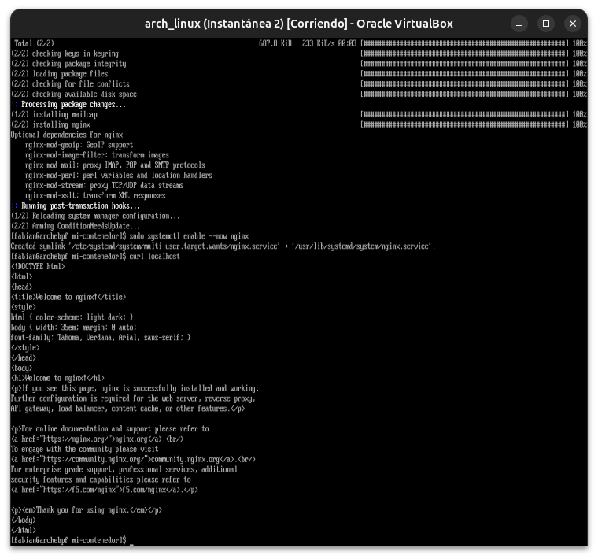

**02 — `nginx.conf`: bloque de reverse proxy editado**
Nuevo `server` en el puerto 8082 apuntando con `proxy_pass` al contenedor Docker del Módulo 24.

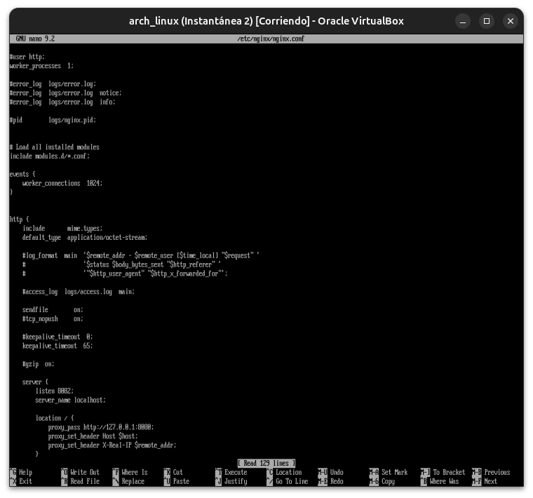

**03 — `nginx -t` y reload**
Validación de sintaxis exitosa antes de aplicar el cambio.

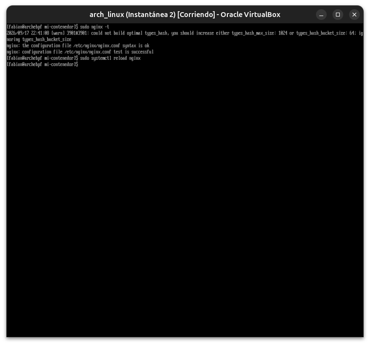

**04 — `curl` al reverse proxy exitoso**
El puerto 8082 devolvió la página del contenedor, mediada por Nginx.

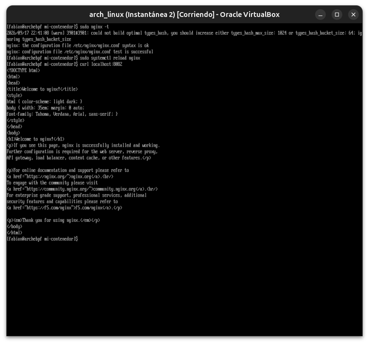

**05 — `docker ps`: contenedor backend activo**
Confirmación de que el contenedor `mi-contenedor-web-1` (del `docker-compose` del Módulo 24) seguía corriendo en el puerto 8080.

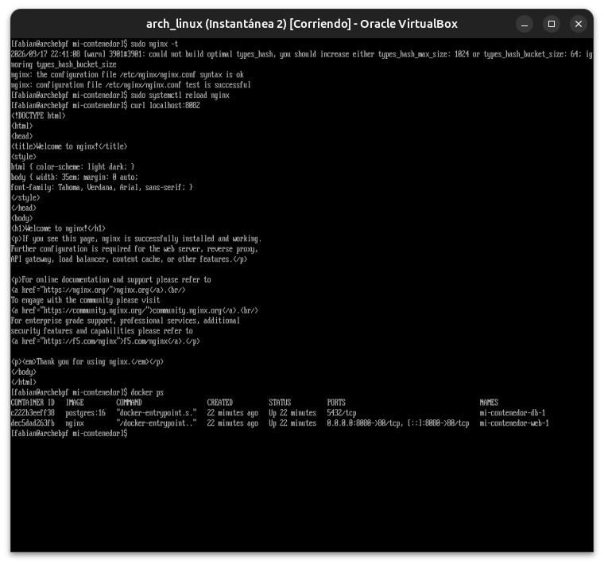

**06 — Typo real en `openssl -subj`**
Un espacio de más al tipear el comando multilínea partió `-subj` en dos tokens, generando un error de sintaxis de OpenSSL.

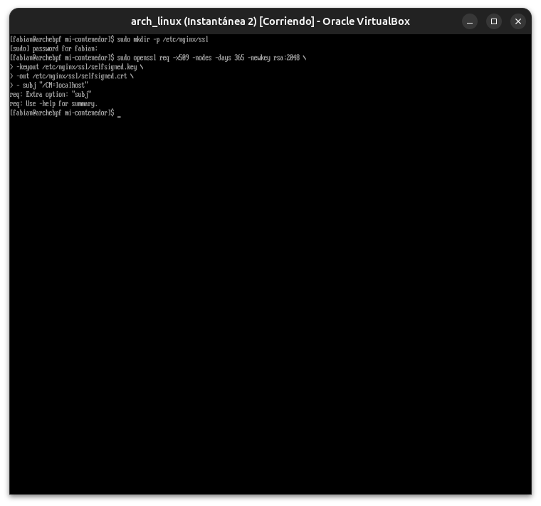

**07 — Certificado autofirmado generado**
Tras corregir el comando en una sola línea, `openssl req` generó la clave y el certificado sin problemas.

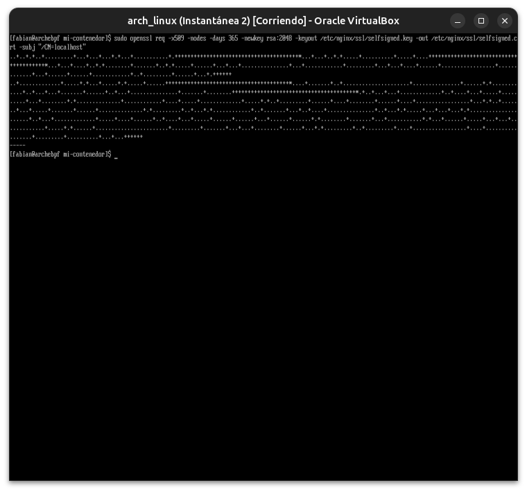

**08 — `nginx.conf` completo: proxy + TLS**
Vista de los dos bloques `server` conviviendo: el reverse proxy (8082) y el servidor HTTPS con certificado autofirmado (8443).

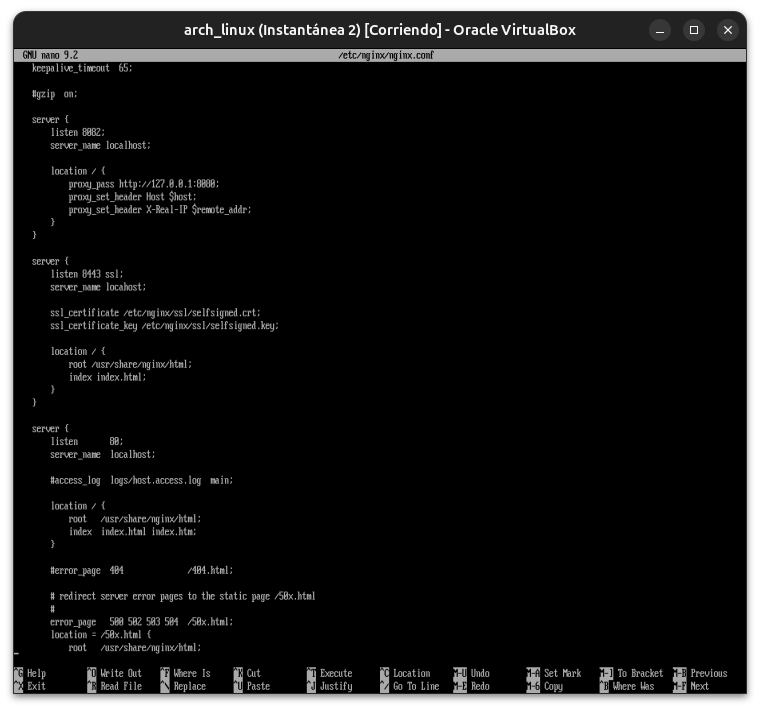

**09 — `curl -k https`: TLS funcionando**
Conexión HTTPS exitosa contra el certificado autofirmado, usando `-k` para omitir la verificación de confianza (esperado, ya que es autofirmado).

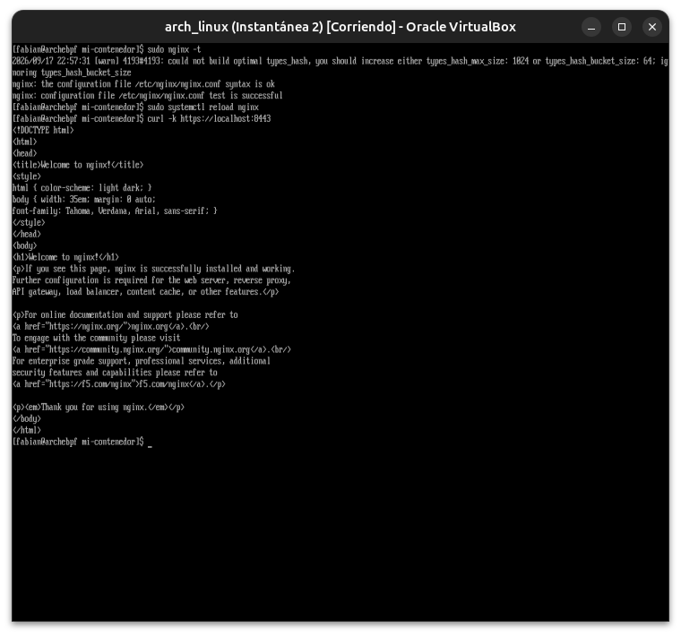

**10 — Caddy instalado**
Instalación del paquete `caddy` y creación automática de su usuario de sistema.

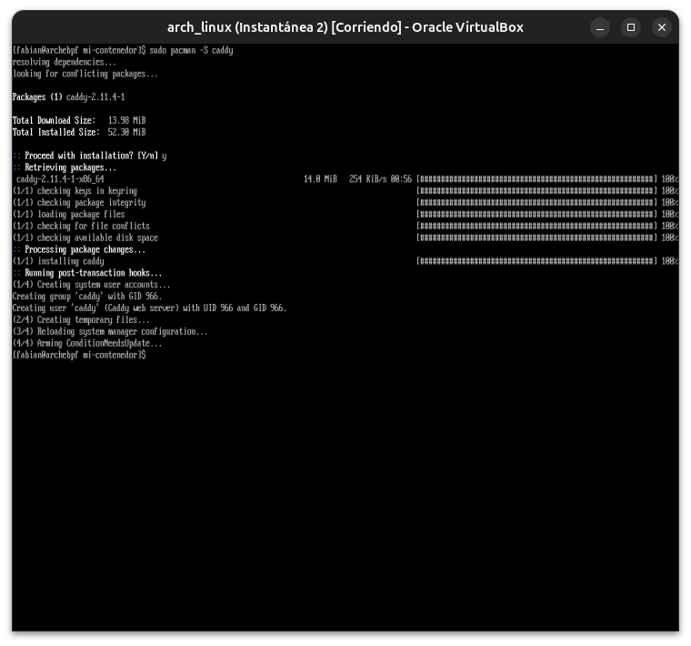

**11 — `Caddyfile` con `tls internal`**
Configuración mínima pidiendo TLS automático mediante la CA interna de Caddy.

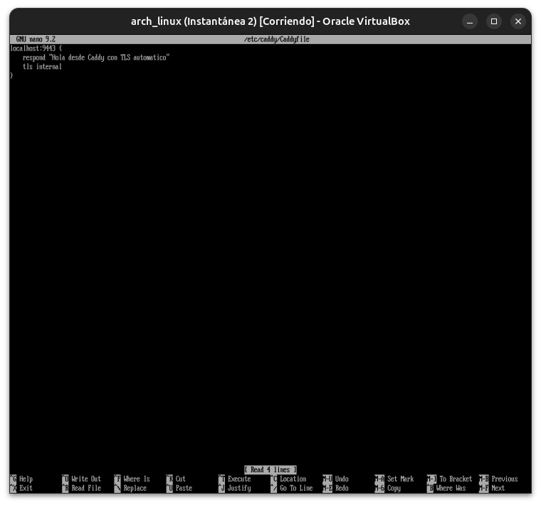

**12 — Caddy falla: puerto 80 ya en uso**
El primer intento de arrancar Caddy falló porque intenta escuchar automáticamente en el puerto 80 (ocupado por Nginx) para redirecciones HTTP→HTTPS.

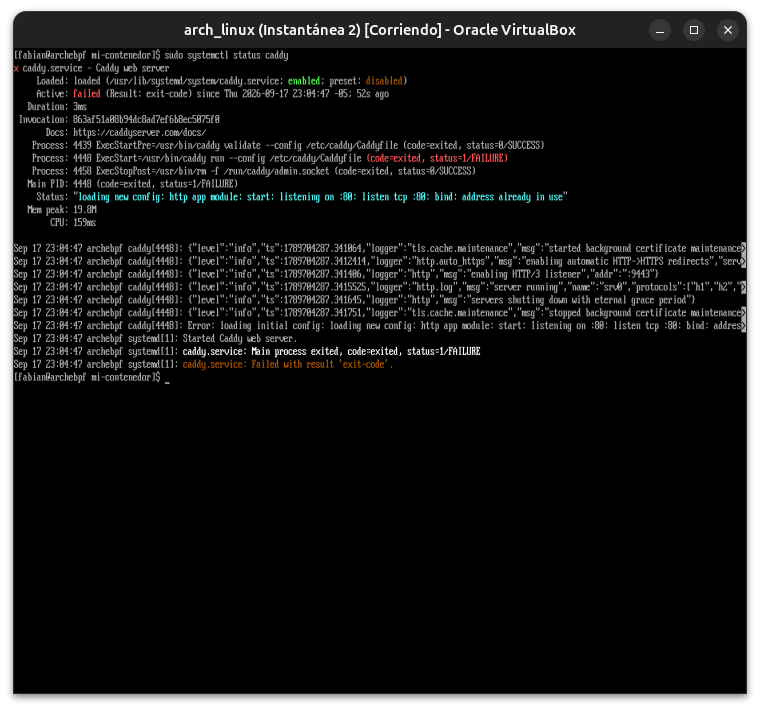

**13 — `auto_https off`: fix del conflicto de puerto**
Se agregó el bloque de opciones globales al `Caddyfile` para deshabilitar el listener automático en el puerto 80.

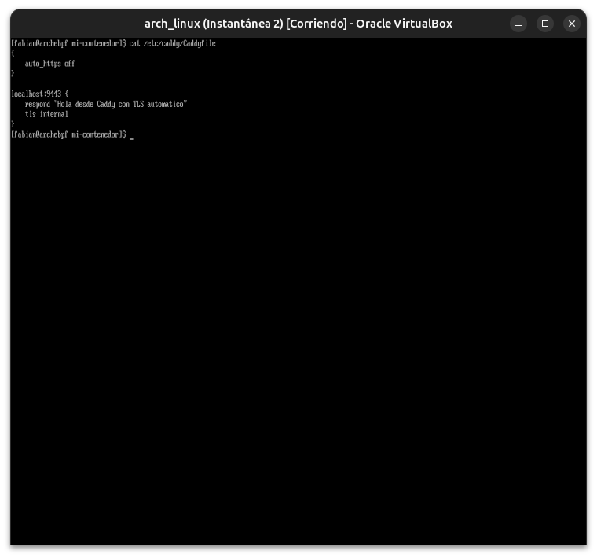

**14 — Caddy corriendo, pero el TLS interno falla**
El servicio ya arranca (`active running`), pero no logra instalar/generar correctamente su CA interna (`pki.ca.local`), y el handshake TLS falla con `SSLv1 alert internal error`.

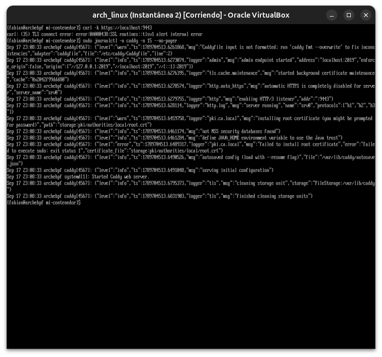

**15 — Limitación documentada: TLS de Caddy sin resolver**
Tras varios reintentos idénticos, se documentó como limitación real del entorno (permisos del usuario de servicio de Caddy) en vez de seguir invirtiendo tiempo — el objetivo pedagógico ya se había cumplido con Nginx.

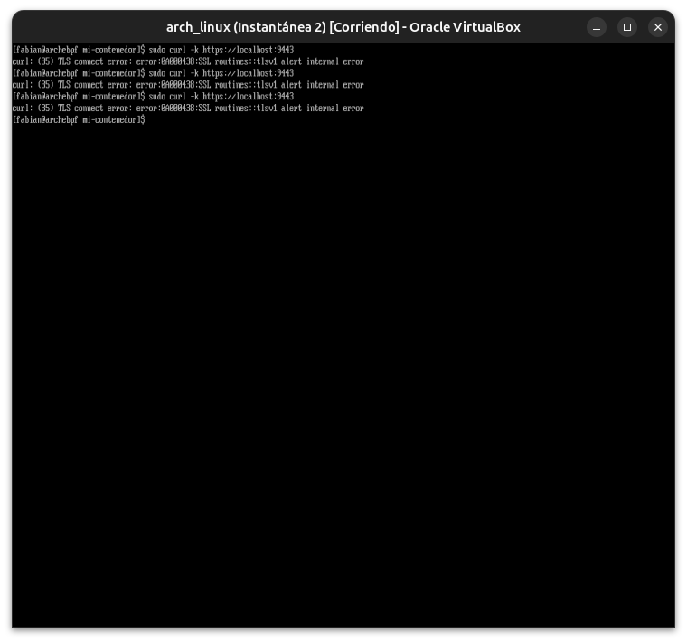

---

**Próximo módulo:** 26 — Bases de datos (PostgreSQL).
