# Módulo 26 — Bases de datos (PostgreSQL)

**Fase V — Infrastructure & Advanced Systems**

---

## Objetivos del módulo

- Entender qué problema resuelve una base de datos relacional frente a guardar datos en archivos.
- Instalar y administrar PostgreSQL como servicio del sistema.
- Dominar SQL básico: crear tablas, insertar, consultar, relacionar.
- Gestionar usuarios/roles y permisos dentro de PostgreSQL.
- Hacer backups y restauraciones con `pg_dump`/`pg_restore`.
- Conectar una aplicación real (Python) a PostgreSQL — cerrando el Proyecto 10 de la guía.

---

## 1. CONCEPTO: ¿por qué una base de datos relacional?

Ya administraste archivos de texto plano todo el curso (`/etc/passwd`, logs, `resolv.conf`). Para configuración del sistema, eso está bien. Pero para datos de una **aplicación** (usuarios, pedidos, transacciones), guardar todo en archivos de texto tiene problemas serios:

- **Sin garantías de consistencia**: dos procesos escribiendo al mismo archivo a la vez pueden corromperlo.
- **Sin relaciones**: ¿cómo modelás "un usuario tiene muchos pedidos" en un archivo plano, de forma eficiente y consultable?
- **Sin transacciones**: si a mitad de una operación falla el sistema, ¿quedan los datos en un estado válido o a medio escribir?

**PostgreSQL resuelve todo esto**: garantiza propiedades ACID (Atomicidad, Consistencia, Aislamiento, Durabilidad — cada operación se completa entera o no se aplica nada), modela relaciones entre datos de forma nativa, y permite consultas complejas con SQL sin tener que escribir tu propio código de búsqueda.

---

## 2. HERRAMIENTA: instalar y arrancar PostgreSQL

```bash
sudo pacman -S postgresql
sudo -iu postgres initdb -D /var/lib/postgres/data    # inicializa el "cluster" de datos (una sola vez)
sudo systemctl enable --now postgresql
```

**Por qué `sudo -iu postgres`:** PostgreSQL crea automáticamente un usuario de sistema llamado `postgres` (recordá el Módulo 04: cuentas de servicio, como `http` o `dbus`), dueño de todos los archivos de datos. Las operaciones de administración inicial se hacen como ese usuario, no como `root` ni tu usuario normal.

```bash
sudo -iu postgres psql    # entrar a la consola interactiva de PostgreSQL, como superusuario de la BD
```

---

## 3. CÓMO FUNCIONA: SQL básico

Dentro de `psql`:

```sql
-- Crear una base de datos
CREATE DATABASE curso_arch;
\c curso_arch          -- conectarte a ella

-- Crear una tabla
CREATE TABLE usuarios (
    id SERIAL PRIMARY KEY,
    nombre TEXT NOT NULL,
    email TEXT UNIQUE NOT NULL,
    creado_en TIMESTAMP DEFAULT NOW()
);

-- Insertar datos
INSERT INTO usuarios (nombre, email) VALUES ('Fabian', 'fabian@ejemplo.com');
INSERT INTO usuarios (nombre, email) VALUES ('Ana', 'ana@ejemplo.com');

-- Consultar
SELECT * FROM usuarios;
SELECT nombre FROM usuarios WHERE email LIKE '%ejemplo.com';

-- Relación: una tabla que referencia a otra
CREATE TABLE pedidos (
    id SERIAL PRIMARY KEY,
    usuario_id INTEGER REFERENCES usuarios(id),
    producto TEXT,
    monto NUMERIC(10,2)
);

INSERT INTO pedidos (usuario_id, producto, monto) VALUES (1, 'Teclado mecánico', 45.99);

-- Consulta con JOIN: combinar datos de ambas tablas
SELECT usuarios.nombre, pedidos.producto, pedidos.monto
FROM pedidos
JOIN usuarios ON pedidos.usuario_id = usuarios.id;
```

**`REFERENCES`** es una **clave foránea** (foreign key): le dice a PostgreSQL que `usuario_id` en `pedidos` debe corresponder a un `id` real y existente en `usuarios` — la base de datos **rechaza** insertar un pedido con un `usuario_id` que no existe, protegiendo la integridad de los datos automáticamente.

Salir de `psql`: `\q`

---

## 4. CÓMO FUNCIONA: usuarios y roles

```sql
CREATE ROLE app_usuario WITH LOGIN PASSWORD 'unapasswordsegura';
GRANT CONNECT ON DATABASE curso_arch TO app_usuario;
GRANT SELECT, INSERT, UPDATE ON usuarios, pedidos TO app_usuario;
```

**Por qué esto importa (conexión con el Módulo 04 y el principio de menor privilegio):** tu aplicación real nunca debería conectarse a la base de datos como `postgres` (superusuario, puede borrar todo). Se crea un rol específico con **solo** los permisos que esa aplicación necesita — igual que un usuario de sistema `http` no tiene por qué poder leer tu `/home`.

---

## 5. HERRAMIENTA: backups con `pg_dump`/`pg_restore`

```bash
sudo -iu postgres pg_dump curso_arch > ~/backup_curso_arch.sql
```

```bash
# Simular pérdida de datos y restaurar
sudo -iu postgres dropdb curso_arch
sudo -iu postgres createdb curso_arch
sudo -iu postgres psql curso_arch < ~/backup_curso_arch.sql
```

**Conexión con el Módulo 15/17:** esto es exactamente el tipo de tarea que en un entorno real automatizarías con un script de Bash (Módulo 17) corriendo por un timer de systemd (Módulo 09), guardando backups regulares — vas a formalizar esto en el Módulo 27 (DevOps).

---

## 6. EJEMPLO: usar el Postgres que YA tenés corriendo (Módulo 24)

Ya tenés un contenedor `postgres:16` corriendo desde el `docker-compose` del Módulo 24. Conectémonos a **ese**, en vez de instalar Postgres nativo en tu sistema (dos instancias de Postgres en la misma máquina competirían por el puerto 5432 por defecto):

```bash
cd ~/proyectos/mi-contenedor
docker-compose ps      # confirmar que "db" sigue corriendo

docker exec -it mi-contenedor-db-1 psql -U postgres
```

Dentro de esa consola, repetí los mismos ejercicios SQL de la sección 3.

---

## 7. EJEMPLO: Proyecto — aplicación Python conectada a PostgreSQL

Vamos a construir el **Proyecto 10 de la guía**, conectando Python (Módulo 19) a la base de datos.

```bash
cd ~/proyectos
mkdir app-postgres && cd app-postgres
python -m venv venv
source venv/bin/activate
pip install psycopg2-binary
nano app.py
```

```python
#!/usr/bin/env python3
import psycopg2

conexion = psycopg2.connect(
    host="localhost",
    port="5432",
    dbname="postgres",
    user="postgres",
    password="ejemplo"   # la que pusiste en docker-compose.yml, Módulo 24
)
cursor = conexion.cursor()

cursor.execute("""
    CREATE TABLE IF NOT EXISTS tareas (
        id SERIAL PRIMARY KEY,
        descripcion TEXT NOT NULL,
        completada BOOLEAN DEFAULT FALSE
    )
""")
conexion.commit()

cursor.execute("INSERT INTO tareas (descripcion) VALUES (%s)", ("Terminar el Modulo 26",))
conexion.commit()

cursor.execute("SELECT id, descripcion, completada FROM tareas")
for fila in cursor.fetchall():
    print(fila)

cursor.close()
conexion.close()
```

```bash
python app.py
```

**Nota de seguridad real:** usar `%s` con `execute()` (en vez de f-strings armando el SQL a mano) previene **SQL injection** — psycopg2 escapa automáticamente el valor. Nunca construyas SQL concatenando strings con datos de usuario directamente; esto lo vas a retomar en el Módulo 29 (Ciberseguridad).

---

## 8. PRÁCTICA

1. Conectate al Postgres del contenedor y creá las tablas `usuarios`/`pedidos` de la sección 3, con datos de prueba.
2. Probá el `JOIN` y confirmá que devuelve los datos combinados correctamente.
3. Creá un rol `app_usuario` con permisos limitados, como en la sección 4.
4. Hacé un `pg_dump` de tu base y confirmá que el archivo `.sql` generado tiene contenido real.
5. Completá el proyecto de la sección 7 (`app.py` con `psycopg2`) y confirmá que la tabla `tareas` se creó y se pudo insertar/leer.

---

## 9. ERROR INTENCIONAL / DIAGNÓSTICO

```sql
INSERT INTO pedidos (usuario_id, producto, monto) VALUES (999, 'Producto fantasma', 10.00);
```

**Diagnóstico:** PostgreSQL rechaza el insert con un error de **violación de clave foránea** (`foreign key constraint violation`) — no existe ningún usuario con `id = 999`. Esto es la base de datos protegiéndote de datos inconsistentes automáticamente, sin que tuvieras que escribir esa validación vos mismo en la aplicación.

---

## Checklist de cierre del módulo

- [ ] Entiendo por qué una base de datos relacional resuelve problemas que archivos planos no pueden.
- [ ] Sé crear tablas, insertar, consultar y relacionar datos con `JOIN`.
- [ ] Entiendo claves foráneas y cómo protegen la integridad de los datos.
- [ ] Sé crear roles con permisos limitados (principio de menor privilegio).
- [ ] Hice un backup y una restauración con `pg_dump`/`pg_restore`.
- [ ] Conecté una aplicación Python real a PostgreSQL, usando parámetros seguros (sin SQL injection).

---

## Evidencias

**01 — Contenedores detenidos: error al conectar**
`docker-compose ps` no mostró nada activo; los contenedores del Módulo 24 habían quedado detenidos entre sesiones.

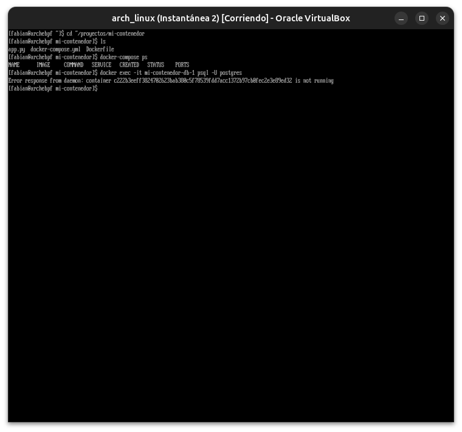

**02 — Tabla `usuarios` creada, con typo real corregido**
Tras levantar los contenedores, se creó la base `curso_arch` y la tabla `usuarios`. Un primer `INSERT` falló por escribir `VALUE` en vez de `VALUES`; corregido al toque, ambos inserts y el `SELECT` funcionaron.

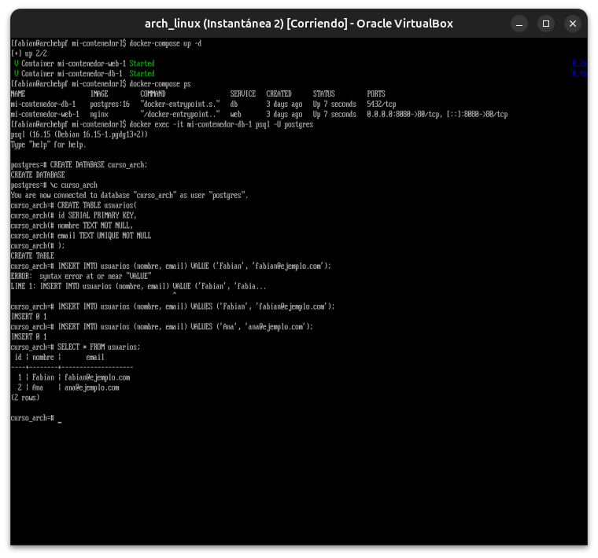

**03 — Tabla `pedidos` y error de `JOIN` con sugerencia automática**
`pedidos.usuarios_id` (typo) generó un error con `HINT` de PostgreSQL sugiriendo la columna correcta — mismo patrón que el `NameError` de Python en el Módulo 19.

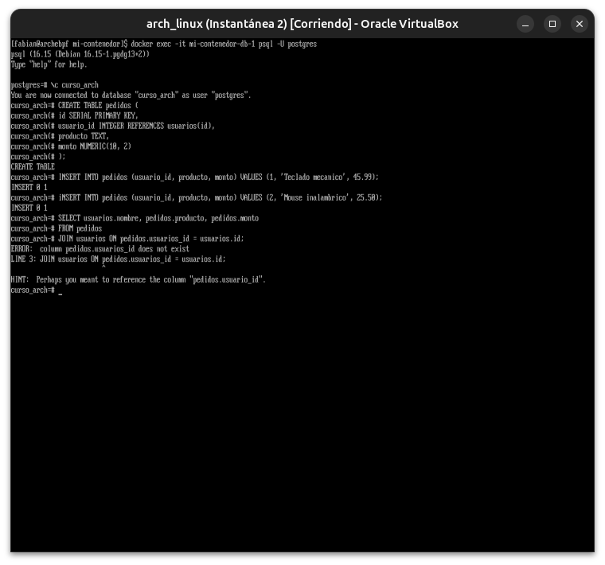

**04 — `JOIN` exitoso**
Consulta combinando `usuarios` y `pedidos` devolviendo los datos relacionados correctamente.

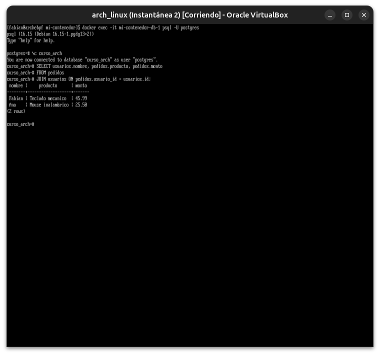

**05 — Violación de clave foránea**
Intentar insertar un pedido con un `usuario_id` inexistente fue rechazado automáticamente por PostgreSQL, protegiendo la integridad de los datos.

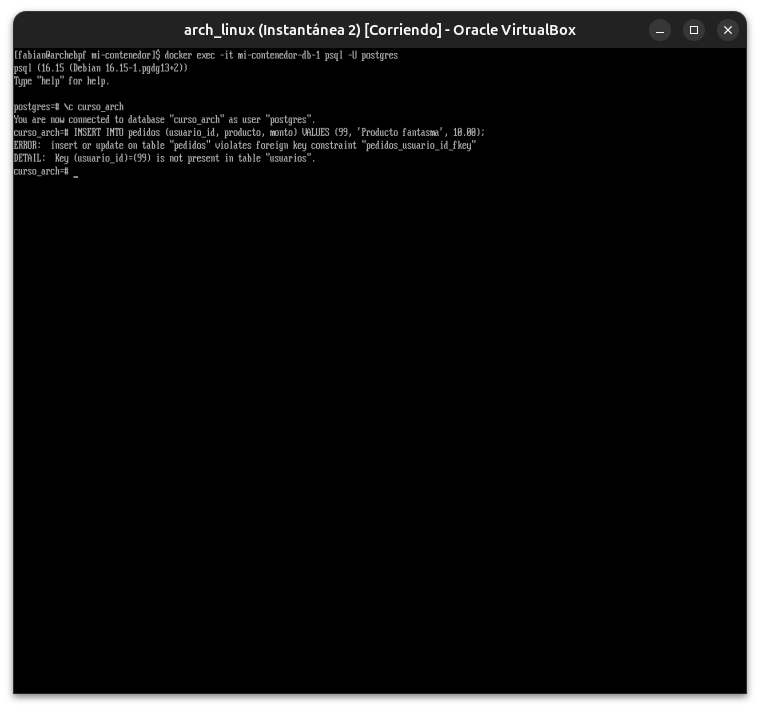

**06 — Rol con permisos limitados**
`CREATE ROLE` + `GRANT` puntuales, aplicando el principio de menor privilegio del Módulo 04.

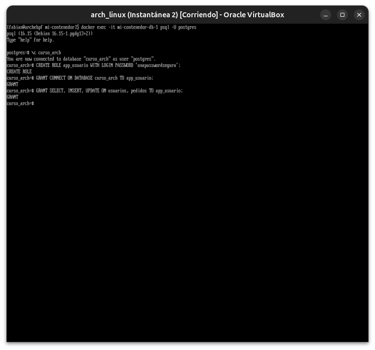

**07 — Backup con `pg_dump`**
Dump completo de la base generado y verificado, listo para restaurar si hiciera falta.

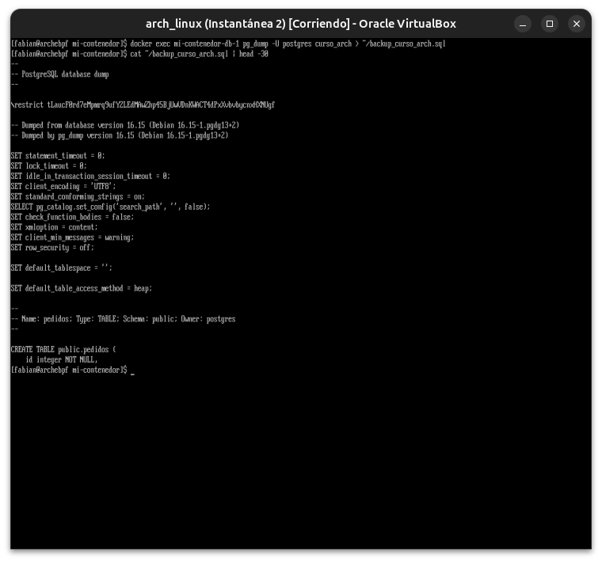

**08 — `psycopg2-binary` instalado**
Entorno virtual y driver de PostgreSQL para Python listos para el Proyecto 10.

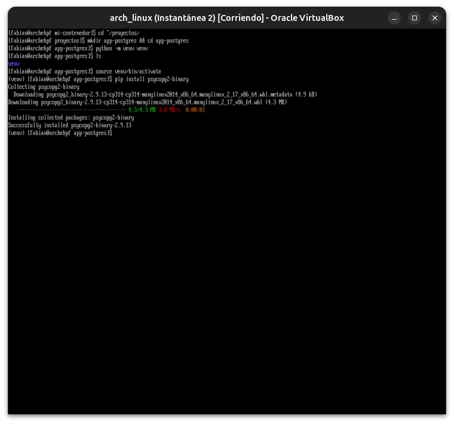

**09 — Primer intento de `app.py`: conexión rechazada**
`Connection refused` — el puerto 5432 del contenedor `db` nunca se había expuesto al host en el `docker-compose.yml`.

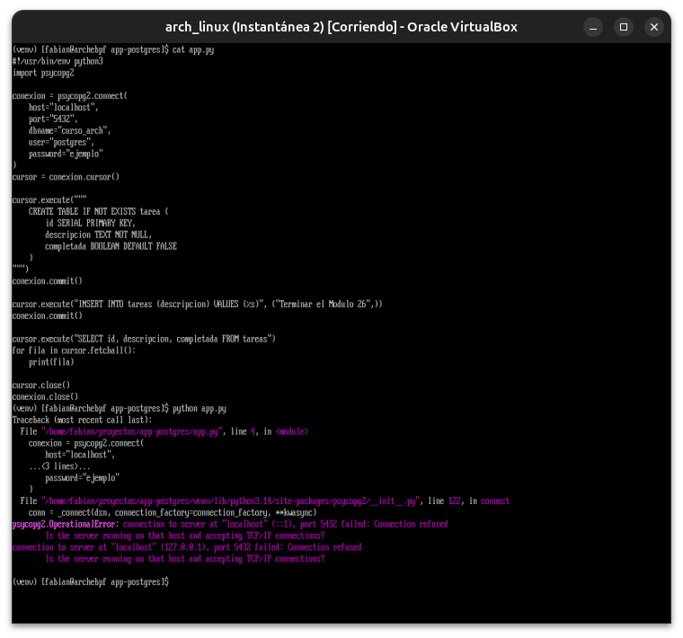

**10 — Puerto 5432 mapeado**
Se agregó `ports: - "5432:5432"` al servicio `db` y se recreó el contenedor; `docker-compose ps` confirma el mapeo.

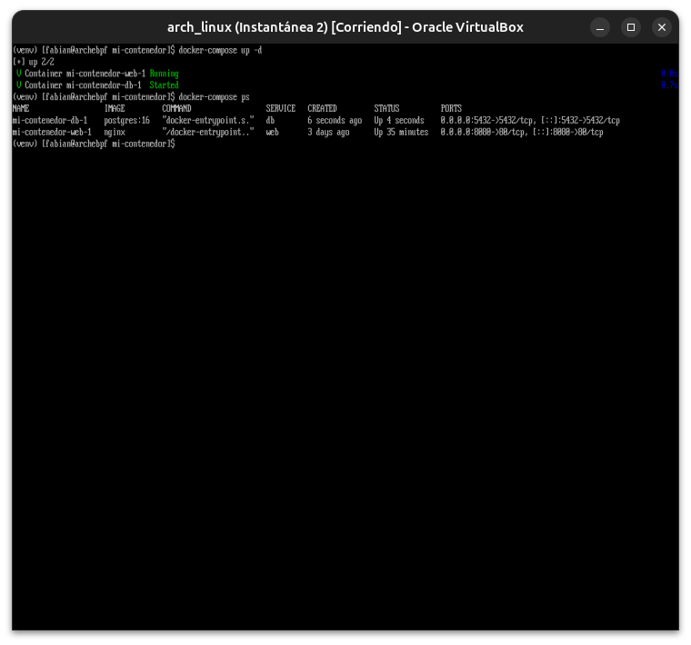

**11 — Segundo error: tabla `tarea` (singular) vs. `tareas` (plural)**
Con la conexión ya funcionando, apareció `relation "tareas" does not exist` — un typo de singular/plural entre el `CREATE TABLE` y el resto del script.

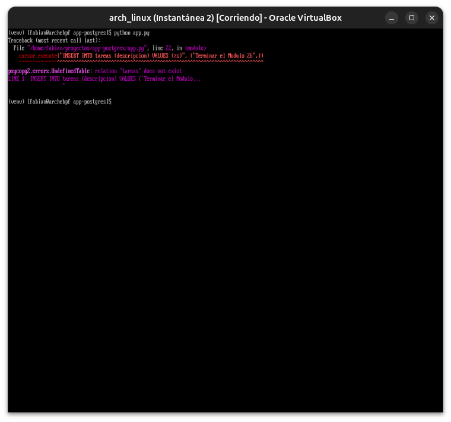

**12 — Fix final: aplicación funcionando de punta a punta**
Corregido con `sed`, el script creó la tabla, insertó y leyó una fila desde PostgreSQL correctamente.

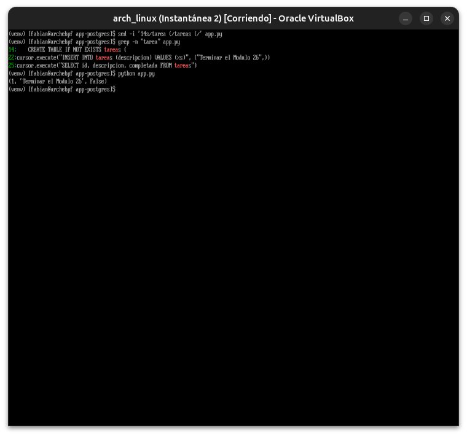

---

**Próximo módulo:** 27 — DevOps (CI/CD, Ansible, IaC).
