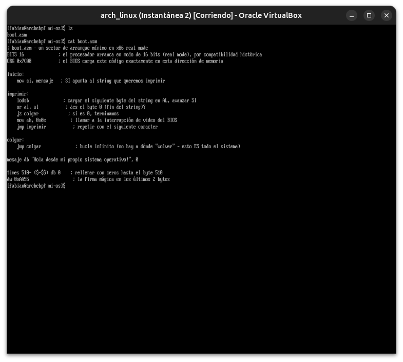
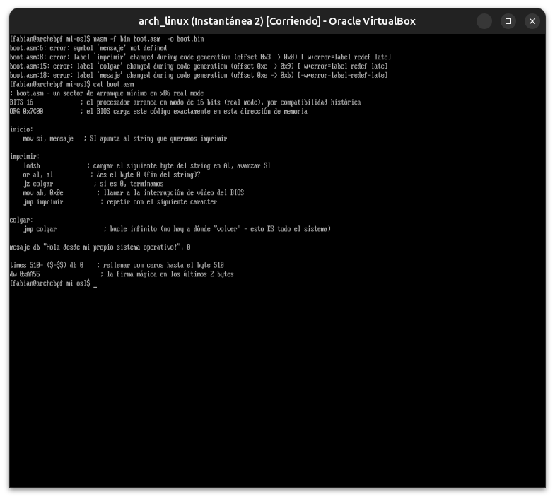
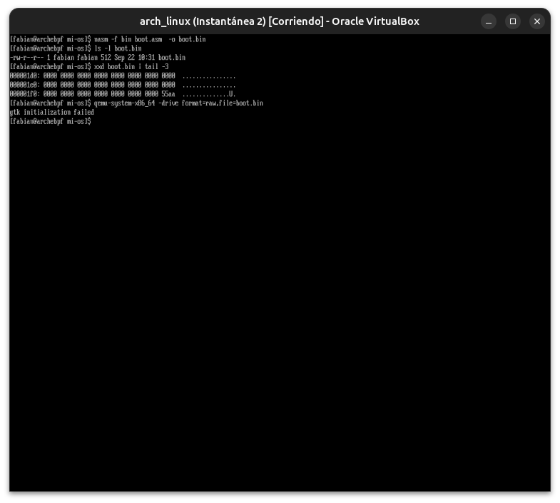
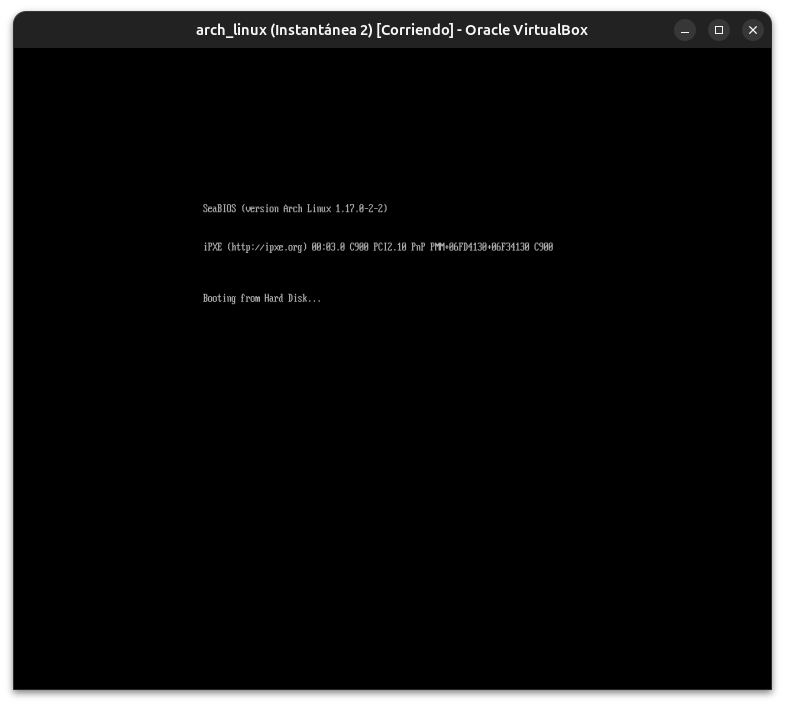
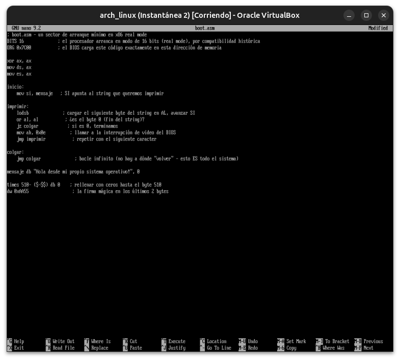
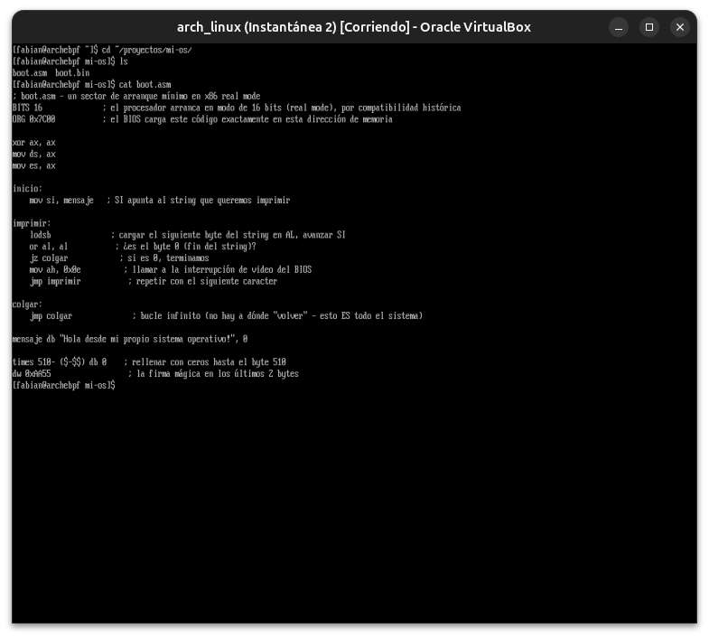
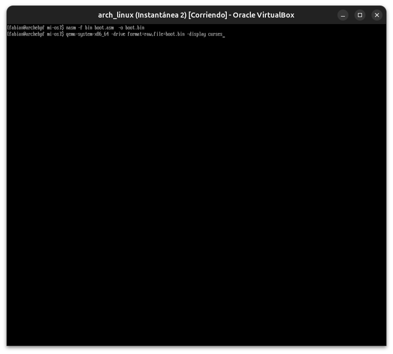
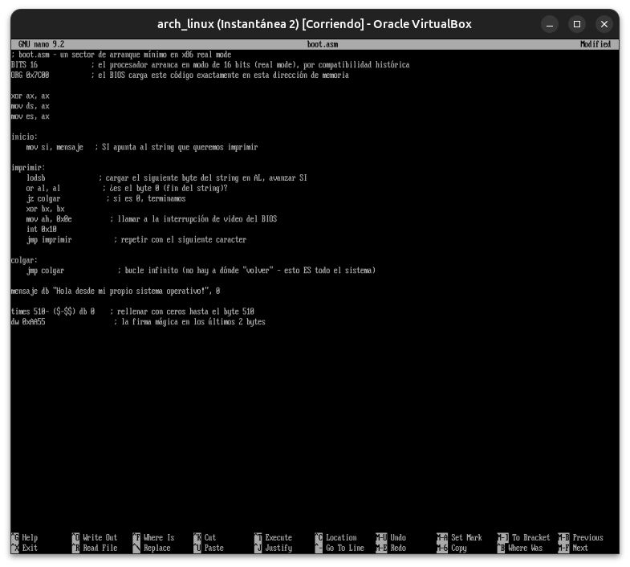
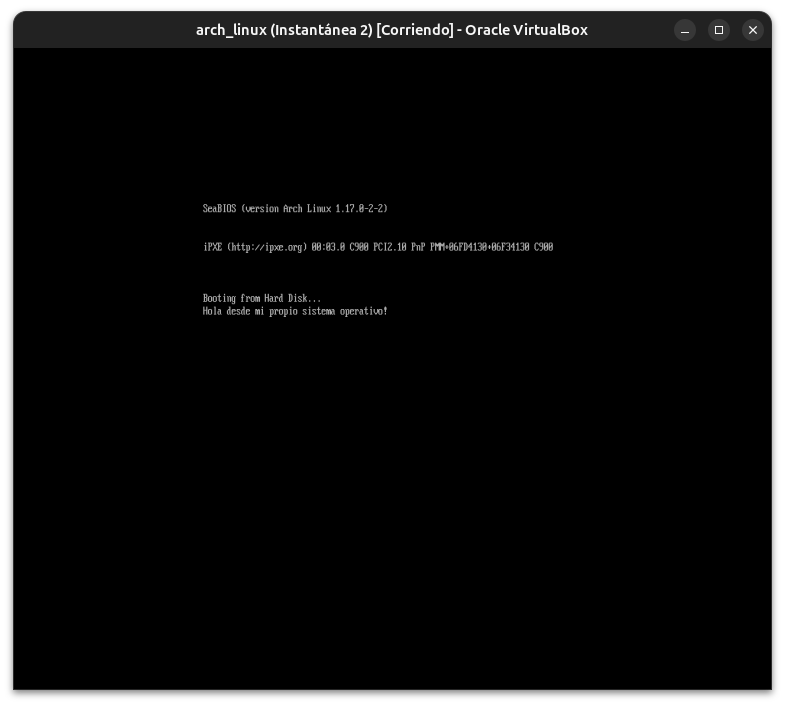

# Módulo 30 — Fundamentos de OS Development

**Fase V — Infrastructure & Advanced Systems**

## Último módulo del curso

---

## Objetivos del módulo

- Escribir, ensamblar y arrancar tu propio sector de arranque (boot sector) en x86 real mode.
- Entender qué hace el firmware exactamente en los primeros microsegundos, a nivel de bytes.
- Conectar cada pieza suelta del curso (Módulos 00, 10, 20, 22) en un solo ejercicio final.
- Probar tu propio "sistema operativo" mínimo en un emulador real.

---

## 1. CONCEPTO: volver al principio — qué hace el firmware, en bytes reales

Todo el curso empezó, en el Módulo 00, con una frase: *"el firmware busca un dispositivo de arranque válido, carga el primer programa que encuentra, y le cede el control"*. Ahora vamos a construir exactamente **ese primer programa**, a mano, byte por byte.

**La regla que el firmware BIOS sigue** (heredada de los años 80, todavía vigente en modo legacy — recordá que tu VM es BIOS, Módulo 00 y 06):

1. Lee los primeros **512 bytes** del disco de arranque.
2. Verifica que los últimos 2 bytes sean exactamente `0x55 0xAA` (la "firma mágica" de un sector de arranque válido).
3. Si coincide, carga esos 512 bytes en la dirección de memoria `0x7C00` y salta ahí — sin saber ni importarle qué contienen.

No hay filesystem, no hay kernel, no hay nada — es el contrato más primitivo posible entre hardware y software. Todo lo que construiste en 29 módulos (systemd, bash, Python, contenedores, bases de datos) existe **por encima** de este momento exacto.

---

## 2. HERRAMIENTA: ensamblador x86 y el entorno de trabajo

```bash
sudo pacman -S nasm qemu-desktop
```

(`qemu-desktop` es un paquete más chico que `qemu-full` del Módulo 23 — alcanza para correr un boot sector sin todo el ecosistema de virtualización completo)

---

## 3. EJEMPLO: tu primer boot sector — "Hola OS"

```bash
mkdir -p ~/proyectos/mi-os
cd ~/proyectos/mi-os
nano boot.asm
```

```nasm
; boot.asm - un sector de arranque mínimo en x86 real mode
BITS 16              ; el procesador arranca en modo de 16 bits (real mode), por compatibilidad histórica
ORG 0x7C00           ; el BIOS carga este código exactamente en esta dirección de memoria

inicio:
    mov si, mensaje   ; SI apunta al string que queremos imprimir

imprimir:
    lodsb              ; cargar el siguiente byte del string en AL, avanzar SI
    or al, al           ; ¿es el byte 0 (fin del string)?
    jz colgar             ; si es 0, terminamos
    mov ah, 0x0e            ; función BIOS 0x0e = "imprimir un caracter en pantalla"
    int 0x10                 ; llamar a la interrupción de video del BIOS
    jmp imprimir               ; repetir con el siguiente caracter

colgar:
    jmp colgar                  ; bucle infinito (no hay a dónde "volver" - esto ES todo el sistema)

mensaje db "Hola desde mi propio sistema operativo!", 0

times 510-($-$$) db 0    ; rellenar con ceros hasta el byte 510
dw 0xAA55                  ; la firma mágica en los últimos 2 bytes
```

**Notas clave sobre lo que acabás de escribir:**
- **`int 0x10`** es una interrupción de BIOS — el firmware expone "servicios" mínimos (como imprimir texto) que podés invocar directamente, sin ningún driver ni sistema operativo de por medio. Esto es lo más cerca que vas a estar de hablarle al hardware directamente en todo el curso.
- **`times 510-($-$$) db 0`** + **`dw 0xAA55`** son exactamente el mecanismo del punto 1 de la sección de arriba — vos mismo estás construyendo la firma mágica que el BIOS va a verificar.

---

## 4. HERRAMIENTA: ensamblar y crear la imagen de disco

```bash
nasm -f bin boot.asm -o boot.bin
ls -l boot.bin        # debería pesar exactamente 512 bytes
xxd boot.bin | tail -3   # confirmá visualmente que termina en "55 aa"
```

---

## 5. EJEMPLO: arrancar tu sistema operativo en QEMU

```bash
qemu-system-x86_64 -drive format=raw,file=boot.bin
```

Se va a abrir una ventana de QEMU (un emulador de PC completo, corriendo tu boot sector como si fuera un disco real) mostrando:

```
Hola desde mi propio sistema operativo!
```

**Este es el momento más significativo del curso.** No hay Linux, no hay kernel de nadie más, no hay pacman — es exactamente **el código que vos escribiste**, ejecutándose directamente sobre hardware emulado, de la misma forma exacta en que arrancó tu Arch Linux en el Módulo 00, tu kernel personalizado en el Módulo 22, y cada sistema operativo que existe.

---

## 6. CÓMO FUNCIONA: por qué esto es "todo el sistema operativo" (por ahora)

Tu boot sector de 512 bytes **es**, técnicamente, un sistema operativo completo — extremadamente mínimo, pero real: tiene control total del hardware, no depende de nada más, y decide qué hacer con cada instrucción. Lo que le falta para ser un OS "completo" como Linux es exactamente lo que fuiste aprendiendo en los 29 módulos anteriores:

| Lo que Linux tiene | Lo que tu boot sector no tiene (todavía) |
|---|---|
| Gestión de memoria virtual | Solo ve memoria física directa |
| Multitarea (Módulo 05) | Un solo flujo de ejecución, sin scheduler |
| Filesystem (Módulo 02) | No sabe leer nada del disco más allá de sus propios 512 bytes |
| Modo protegido de 32/64 bits | Corre en 16-bit real mode, el modo más primitivo del procesador |
| Drivers | Solo puede usar los servicios mínimos que el BIOS expone vía interrupciones |

---

## 7. PRÁCTICA

1. Escribí, ensamblá y arrancá tu boot sector, confirmando el mensaje en QEMU.
2. Modificá el mensaje para que incluya tu nombre.
3. Agregá una segunda línea de texto (pista: `int 0x10` con `ah=0x0e` imprime un caracter por vez; necesitás imprimir `0x0D` y `0x0A` — retorno de carro y salto de línea — entre ambos mensajes).
4. Reflexioná (por escrito, para vos): recorriendo mentalmente el curso completo desde el Módulo 00, identificá **3 conceptos específicos** que ahora entendés mejor gracias a haber construido este boot sector con tus propias manos.

---

## 8. ERROR INTENCIONAL / DIAGNÓSTICO

```bash
nano boot.asm
```
Borrá la línea `dw 0xAA55` (o cambiala por otro valor), volvé a ensamblar y arrancar:
```bash
nasm -f bin boot.asm -o boot.bin
qemu-system-x86_64 -drive format=raw,file=boot.bin
```

**Diagnóstico:** el BIOS (emulado por QEMU) va a rechazar el disco como no-arrancable, típicamente mostrando algo como `Booting from Hard Disk...` seguido de un cuelgue o un mensaje de "no bootable device" — la confirmación exacta y tangible de la regla que explicamos en la sección 1: sin la firma `0x55 0xAA` en los bytes 511-512, el firmware ni siquiera intenta ejecutar tu código.

---

## Evidencias

**01 — `boot.asm`: código inicial, con un typo escondido**
El código usa `mov si, mensaje` y `mensaje db "..."` como si coincidieran — pero la etiqueta real quedó tipeada `mesaje` (sin la primera "n"). Bug real de tipeo, no intencional.



**02 — `nasm`: `error: symbol 'mensaje' not defined`**
El ensamblador confirma el typo: `imprimir` referencia `mensaje`, pero solo existe la etiqueta `mesaje`. SÍNTOMA → LOG → CAUSA RAÍZ en un solo mensaje de error.



**03 — Compilación OK tras corregir el typo, pero QEMU falla: `gtk initialization failed`**
`boot.bin` pesa 512 bytes exactos y termina en `55aa` (firma válida) — el binario está bien. El problema es el entorno: QEMU no tiene backend gráfico GTK disponible en esta VM.



**04 — SeaBIOS arranca, pantalla en blanco**
Cambiando el display de QEMU, el boot sector sí arranca (`Booting from Hard Disk...`) pero no aparece ningún mensaje en pantalla — segundo bug, distinto del primero.



**05 — Sin mensaje: registros de segmento `DS`/`ES` sin inicializar**
El cursor parpadea, pero el string nunca se imprime. Causa raíz: en real mode, `SI` se interpreta relativo a `DS`, y `DS`/`ES` arrancan con un valor indefinido del BIOS — el string se lee de la dirección de memoria equivocada.


**06 — Fix: inicializar `DS`/`ES` en `nano`**
Se agrega `xor ax, ax` / `mov ds, ax` / `mov es, ax` al principio del código, para forzar `DS=ES=0` antes de usar `SI`.



**07 — Reintento: sigue sin mostrar el mensaje**
Con `DS`/`ES` ya corregidos, la pantalla sigue en blanco — evidencia de que había un tercer bug independiente, todavía sin diagnosticar en este punto.


**08 — `cat boot.asm`: confirmando que el fix de `DS`/`ES` quedó aplicado**
Verificación de que el código en disco tiene el fix del paso 06, antes de seguir buscando el siguiente bug.



**09 — Recompilación y `qemu-system-x86_64 -display curses`**
Se prueba con otro backend de display para descartar que el problema fuera del emulador y no del código.



**10 — Tercer intento: sigue en blanco**
Confirmado: el problema es del código, no del display. Causa raíz encontrada — falta inicializar `BX` (número de página de video) antes de llamar a la interrupción `int 0x10`.


**11 — Fix: agregar `xor bx, bx` antes de `int 0x10`**
El registro `BX` (específicamente `BH`, número de página) quedaba con basura de memoria; sin inicializarlo, la función `0x0e` de la interrupción de video del BIOS no imprime nada de forma confiable.



**12 — Éxito: `Hola desde mi propio sistema operativo!` impreso en pantalla**
Los tres bugs (typo `mensaje`/`mesaje`, `DS`/`ES` sin inicializar, `BX` sin inicializar) diagnosticados y corregidos — el boot sector arranca y muestra su mensaje, cerrando el curso completo.



---

## Checklist de cierre del módulo (y del curso completo)

- [ ] Escribí un boot sector real en ensamblador x86.
- [ ] Entiendo la firma mágica `0xAA55` y por qué el BIOS la exige.
- [ ] Usé una interrupción de BIOS (`int 0x10`) para interactuar con hardware sin sistema operativo de por medio.
- [ ] Arranqué mi propio código en QEMU y vi el resultado real.
- [ ] Provoqué y diagnostiqué el rechazo de un boot sector inválido.
- [ ] Puedo explicar, en mis propias palabras, la diferencia entre mi boot sector y un sistema operativo completo.

---

## Cierre del curso — De Cero a Ingeniero de Sistemas Linux

Con este módulo termina el recorrido completo: 6 fases, 30 módulos, desde entender qué es un bit de memoria (Módulo 00) hasta escribir código que arranca directamente sobre hardware emulado (Módulo 30) — pasando por systemd, redes, seguridad, Bash, Python, C, Rust, kernel, virtualización, contenedores, bases de datos, DevOps, observabilidad y ciberseguridad defensiva, todo practicado en tu propia VM de Arch Linux, con errores reales, mirrors caídos, firewalls mal configurados, typos, y cada incidente diagnosticado con la misma metodología: **SÍNTOMA → OBSERVACIÓN → LOG → CAUSA RAÍZ → SOLUCIÓN → VALIDACIÓN**.

El repositorio completo, con cada módulo documentado y cada evidencia real, queda como registro permanente de todo el proceso — no un certificado, sino la prueba de que cada paso se ejecutó de verdad.
